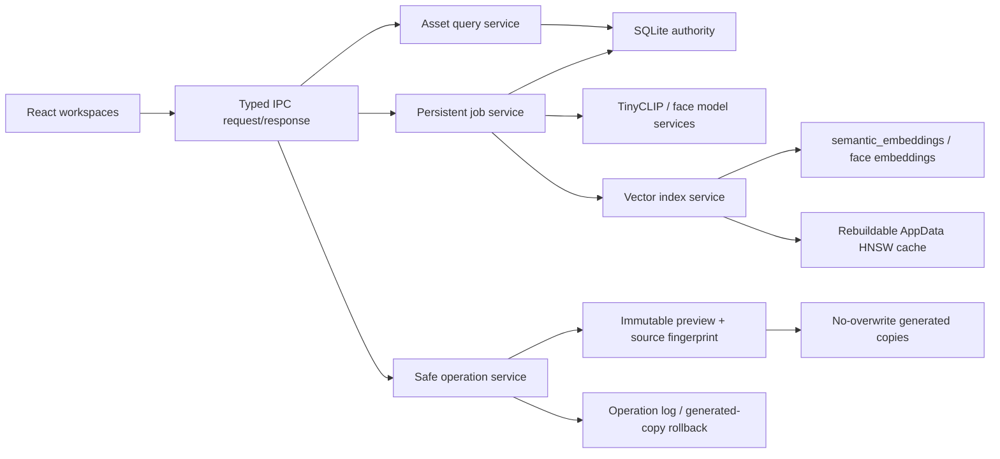
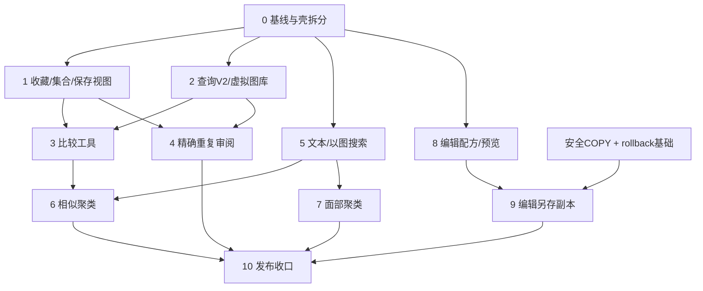

# Plan 0018：借鉴 Lap 的本地图库工作流扩展

- 状态：MVP_IMPLEMENTED_WITH_FACE_MODEL_GATE
- 计划日期：2026-08-09
- 适用仓库：PhotoOrganizer 当前工作区
- 参考项目：[julyx10/lap](https://github.com/julyx10/lap)
- 参考提交：`590ed3d04d17ece2feb763cc48d86b4ceb20176a`
- 架构决策：[ADR 0005](../decisions/0005-local-search-and-photo-workflow-expansion.md)

## 1. 目标

在不推翻当前架构、不改变原图只读原则的前提下，分阶段加入以下能力：

1. 收藏、集合和保存视图；
2. 面向大图库的虚拟化浏览、分组、状态栏和更成熟的信息面板；
3. 双图/四图比较与审片工作流；
4. 精确重复文件发现、保留项审阅和安全“唯一副本集”计划；
5. 本地文本搜索、以图搜图和相似图像聚类；
6. 明确 opt-in 的本地面部检测与人物聚类；
7. 非破坏性编辑配方、预览和安全另存副本；
8. 借鉴 Lap 的信息密度与工作区组织，同时继续使用 PhotoOrganizer 的冷灰、低饱和灰蓝、新拟物表面和 React 组件体系。

这份计划用于直接指导后续 Agent 开发。每个阶段都有依赖、文件范围、数据模型、IPC、测试和停止条件，禁止把全部能力放进一次大改。

### 1.1 2026-08-09 MVP 实施快照

本轮已完成收藏、集合、精确重复审阅、本地文本搜索、以图搜图、相似图片聚类、双图/四图比较、非破坏性编辑预览与安全另存副本，并增加独立的智能工作台 UI。实现集中在 migration 0011、Rust `workflow.rs`、IPC/API 类型和 React `WorkflowWorkspace`，未引入新的生产依赖。

受当前仓库 MVP 明确排除“人脸身份识别”以及权重许可边界影响，人脸部分只完成默认关闭、模型状态、派生表和 clear-all 隐私边界；没有模型时不会伪装为可用。虚拟滚动/HNSW 也未在未达性能阈值前引入，当前使用 SQLite 分页、精确余弦和有界候选聚类。

## 2. 结论先行

推荐路线不是移植 Lap，而是把它拆成可独立验收的产品模式，再落在当前已经存在的能力之上：

| 能力     | 当前基础                                       | 选型结论                                                                    |
| -------- | ---------------------------------------------- | --------------------------------------------------------------------------- |
| 收藏     | 已有 rating / color label                      | 在 `assets` 增加独立 `is_favorite`，不能把五星等同收藏                      |
| 集合     | 已有单一 virtual library assignment            | 新增多对多 collections；assignment、collection、saved view 三者保持不同语义 |
| 成熟浏览 | SQLite 分页、三栏 UI、网格/单图                | 引入分块查询 + TanStack Virtual；保留自有 CSS，不引入 Tailwind/daisyUI      |
| 比较     | 已有 `usePreviewController`、Navigator、胶片栏 | 抽取 pane controller；先双栏，再四栏和同步视口                              |
| 精确重复 | 扫描已生成完整 BLAKE3 fingerprint              | 直接按 size + fingerprint 分组；不重复 hash，不删除原图                     |
| 文本搜索 | TinyCLIP 合并模型、tokenizer、512 维向量       | 增加任意文本编码；先英文语义空间 + 本地中文短语映射                         |
| 以图搜图 | `semantic_embeddings` 已持久化                 | 精确余弦为基线；大图库按基准引入 `hnsw_rs`                                  |
| 相似聚类 | 已有图像向量                                   | HNSW 候选 + 精确复核 + complete-link/互为近邻，避免弱链串组                 |
| 面部聚类 | 已有 ONNX Runtime 和持久任务模式               | 先做 YuNet + SFace 许可/契约 PoC，再做 HNSW 图 + Chinese Whispers           |
| 图像编辑 | 已有 `image` crate、预览加载和安全整理预览     | SQLite 配方 + Rust 同构预览/导出；只能另存副本，不能覆盖原图                |
| UI       | 已有三栏、深浅主题、可调侧栏、视觉令牌         | 借鉴工作区和密度，不复制 Lap 视觉代码；增加模式导航、状态栏、直方图         |

## 3. 假设与硬约束

### 3.1 假设

- 当前未提交改动代表正在进行中的用户工作，后续 Agent 必须保留并基于实际合并结果工作。
- 当前真实实现以源码和 `docs/current-functionality.md` 为准，不以旧 roadmap 中已经过时的 milestone 状态为准。
- `assets.fingerprint` 是扫描时计算的完整内容 BLAKE3，可作为字节级精确重复判断依据。
- 当前 TinyCLIP embedding 为 512 维，并包含模型名、版本、分析版本和源 fingerprint。
- 首要发行平台仍是 Windows 10/11 x64，所有跨平台行为需要明确验证后再承诺。

### 3.2 不可突破的约束

- 浏览、分析、聚类、收藏、集合、比较和保存编辑配方不得写入原图目录。
- 不删除、移动、重命名或覆盖原图。
- 不实现永久删除。
- 所有会产生新文件的动作必须先 preview、校验 source fingerprint、校验目标边界、拒绝覆盖并预写日志。
- 文件系统测试只能使用 `test-data/` 和测试创建的临时输出目录。
- 中文、西里尔字母、空格、组合 Unicode 路径必须进入自动化测试矩阵。
- 不增加账号、远程后端、云同步或默认联网。
- 不直接复制 GPL 的 Lap 源码或资源。
- 不静默增加 Python、OpenCV、Tailwind、daisyUI、SQLite 原生扩展或生产模型。

## 4. 本地参考仓库

Lap 已浅克隆到本地 `reference/lap`，主仓库通过 `.gitignore` 忽略 `reference/`。该目录只用于阅读和对照，不参与构建。

后续 Agent 若本地目录不存在，执行：

```powershell
git clone --depth 1 https://github.com/julyx10/lap.git reference/lap
git -C reference/lap fetch --depth 1 origin 590ed3d04d17ece2feb763cc48d86b4ceb20176a
git -C reference/lap checkout 590ed3d04d17ece2feb763cc48d86b4ceb20176a
```

不要初始化 Lap 的 LibRaw、libjpeg-turbo、libheif、libde265 submodule；这些与当前计划无关，且会显著增加本地体积和原生构建面。

关键参考入口：

- [Lap README（本地）](../../reference/lap/README.md) / [GitHub 固定提交](https://github.com/julyx10/lap/blob/590ed3d04d17ece2feb763cc48d86b4ceb20176a/README.md)
- [Lap 数据和查询实现（本地）](../../reference/lap/src-tauri/src/t_sqlite.rs) / [GitHub](https://github.com/julyx10/lap/blob/590ed3d04d17ece2feb763cc48d86b4ceb20176a/src-tauri/src/t_sqlite.rs)
- [Lap 精确重复实现（本地）](../../reference/lap/src-tauri/src/t_dedup.rs) / [GitHub](https://github.com/julyx10/lap/blob/590ed3d04d17ece2feb763cc48d86b4ceb20176a/src-tauri/src/t_dedup.rs)
- [Lap 相似分组实现（本地）](../../reference/lap/src-tauri/src/t_similar.rs) / [GitHub](https://github.com/julyx10/lap/blob/590ed3d04d17ece2feb763cc48d86b4ceb20176a/src-tauri/src/t_similar.rs)
- [Lap 本地 AI（本地）](../../reference/lap/src-tauri/src/t_ai.rs) / [GitHub](https://github.com/julyx10/lap/blob/590ed3d04d17ece2feb763cc48d86b4ceb20176a/src-tauri/src/t_ai.rs)
- [Lap 面部索引（本地）](../../reference/lap/src-tauri/src/t_face.rs) / [GitHub](https://github.com/julyx10/lap/blob/590ed3d04d17ece2feb763cc48d86b4ceb20176a/src-tauri/src/t_face.rs)
- [Lap 面部聚类（本地）](../../reference/lap/src-tauri/src/t_cluster.rs) / [GitHub](https://github.com/julyx10/lap/blob/590ed3d04d17ece2feb763cc48d86b4ceb20176a/src-tauri/src/t_cluster.rs)
- [Lap 比较查看器（本地）](../../reference/lap/src-vite/src/views/ImageViewer.vue) / [GitHub](https://github.com/julyx10/lap/blob/590ed3d04d17ece2feb763cc48d86b4ceb20176a/src-vite/src/views/ImageViewer.vue)
- [Lap 编辑器（本地）](../../reference/lap/src-vite/src/views/ImageEditor.vue) / [GitHub](https://github.com/julyx10/lap/blob/590ed3d04d17ece2feb763cc48d86b4ceb20176a/src-vite/src/views/ImageEditor.vue)
- [Lap 编辑后端（本地）](../../reference/lap/src-tauri/src/t_image.rs) / [GitHub](https://github.com/julyx10/lap/blob/590ed3d04d17ece2feb763cc48d86b4ceb20176a/src-tauri/src/t_image.rs)
- [Lap 虚拟滚动（本地）](../../reference/lap/src-vite/src/components/VirtualScroll.vue) / [GitHub](https://github.com/julyx10/lap/blob/590ed3d04d17ece2feb763cc48d86b4ceb20176a/src-vite/src/components/VirtualScroll.vue)
- [Lap 收藏/星级控件（本地）](../../reference/lap/src-vite/src/components/FavoriteRatingControl.vue)
- [Lap Collections UI（本地）](../../reference/lap/src-vite/src/components/CollectionTray.vue)
- [Lap UI 截图（本地）](../../reference/lap/docs/public/screenshots/Lap_0.3.0_main_1.png)

## 5. 当前项目基线审计

### 5.1 可直接复用

- [`src-tauri/src/scanner.rs`](../../src-tauri/src/scanner.rs)
  - 递归发现 JPEG/PNG/WebP；
  - 完整 BLAKE3 fingerprint；
  - 增量扫描和 source identity；
  - 缺失文件状态而非删除记录。
- [`src-tauri/src/imaging.rs`](../../src-tauri/src/imaging.rs)
  - 方向修正、缩略图、EXIF、连续色调/色彩特征；
  - 可扩展为编辑预览和直方图核心。
- [`src-tauri/src/semantic.rs`](../../src-tauri/src/semantic.rs)
  - TinyCLIP INT8、tokenizer、图像/文本 embedding 输出；
  - 已有 cosine similarity；
  - 当前只把文本侧用于固定 label prompts。
- [`src-tauri/src/semantic_tasks.rs`](../../src-tauri/src/semantic_tasks.rs) 与 [`tasks.rs`](../../src-tauri/src/tasks.rs)
  - 持久 job、进度、暂停、恢复、取消模式；
  - 可抽象成 image embedding、face index、similar cluster、index rebuild 等任务。
- [`src-tauri/src/db.rs`](../../src-tauri/src/db.rs)
  - SQLite repository、递归 library scope、数据库筛选、分页、详情/网格分离；
  - 已有 `semantic_embeddings` 和 `analysis_jobs`。
- [`src/components/usePreviewController.ts`](../../src/components/usePreviewController.ts)
  - fit/zoom/pan/Navigator 基础；
  - 可扩展为多 pane controller。
- [`src/App.tsx`](../../src/App.tsx)
  - active、preview、selection 三种状态已分离；
  - 网格、单图、组织工作区和可调三栏已经可用。
- [`src/styles.css`](../../src/styles.css)
  - 深浅主题、冷灰令牌、圆角浮起/凹面、紧凑工具栏；
  - 新工作区应扩展令牌而不是覆盖视觉体系。

### 5.2 开发前必须补的结构问题

- `App.tsx` 仍集中管理图库、查询、选择、预览、扫描、语义、组织、拖拽和主题状态；继续叠加会使回归风险过高。
- `list_assets` 使用页码/offset，一次网格只显示固定页，不具备大图库连续滚动窗口。
- `AssetGridItem` 在 TypeScript 暂时仍是 `AssetListItem` alias；查询窗口化前应真正缩小 contract。
- 语义 trait 只有 `classify_batch`，没有独立 `encode_text` / `encode_images`。
- `semantic_embeddings` 有向量但 repository 没有批量流式读取、按模型读取和搜索 API。
- file operation / COPY executor 尚未完成；编辑导出不能绕过这项基础。
- 当前 rating/color label 已存在，但 favorite、collection、saved view 不存在。
- 没有统一的 workspace route/state，新增 compare/dedup/people/editor 前需要建立。

## 6. Lap 功能审计与采用边界

| Lap 能力                 | Lap 实现证据                                                | PhotoOrganizer 决策                                                 | 优先级 |
| ------------------------ | ----------------------------------------------------------- | ------------------------------------------------------------------- | ------ |
| Favorite / Rating        | `afiles.is_favorite`、`rating`、`FavoriteRatingControl.vue` | 独立 favorite；复用已有 rating；增加快捷键和系统视图                | P0     |
| Collections              | `acollections` + `acollections_files`，不移动原图           | 采用多对多本地集合；与 library assignment 分离                      | P0     |
| Smart Albums             | 规则 JSON + 查询/分组/排序                                  | 改名“保存视图”；只保存可验证的 `AssetQuery` JSON，不保存 SQL        | P1     |
| 大图库浏览               | `Content.vue` 分块取数、`VirtualScroll.vue`                 | 用 React headless virtualizer + range cache 独立实现                | P0     |
| Timeline / Group         | 日期、文件夹、评分、位置、相机、镜头等分组                  | 首批日期/文件夹/分类/评分/收藏/集合；位置需 GPS 后再做              | P1     |
| 状态栏/直方图            | 底部状态栏、右栏 RGB/Luma histogram                         | 采用；保持当前低饱和视觉，不复制 CSS                                | P1     |
| 2/4 pane compare         | `ImageViewer.vue`，active pane + sync viewport              | 采用；复用现有 preview controller                                   | P0     |
| Exact dedup              | 同 size 候选、BLAKE3、keep/review/group                     | 采用分组和审阅；直接复用已有 fingerprint；删除改为排除/唯一副本计划 | P0     |
| Text/image search        | CLIP text/image encoding + cosine                           | 采用；先复用当前 TinyCLIP，不再引入一套 vision model                | P0     |
| Similar groups           | HNSW 候选、0.93 阈值、complete-link 风格合并                | 采用算法结构；阈值由本项目评估，不复制常量                          | P1     |
| Face clustering          | RetinaFace/MobileFaceNet + O(N²) graph + Chinese Whispers   | 产品工作流采用；模型改为许可清晰候选，图构建改 HNSW                 | P1     |
| Image editor             | crop/rotate/flip/resize/basic adjustment/save               | 采用非破坏性配方和另存副本；拒绝 overwrite original                 | P1     |
| Culling flags            | pick/reject/unreviewed                                      | 收藏/评分稳定后采用本地审片状态，不写元数据                         | P2     |
| RAW/HEIF/JXL/video       | 多原生子模块与 FFmpeg                                       | 延期；与本计划核心目标无关且显著扩大打包面                          | 不做   |
| Map                      | Leaflet + 在线 tile                                         | 延期；当前无完整 GPS 数据且默认联网不符合本轮目标                   | 不做   |
| Trash / permanent delete | 系统废纸篓和永久删除命令                                    | 明确拒绝                                                            | 禁止   |
| Tailwind/daisyUI/Vue     | Lap 前端技术栈                                              | 不采用                                                              | 禁止   |

## 7. 目标产品结构

### 7.1 工作区

保留当前顶部工具栏和三栏比例，在左侧增加紧凑“模式导航”，模式改变中央工作区和左侧上下文，不创建第二套应用壳：

```text
PhotoOrganizer Shell
├── 图库 Library
│   ├── 全部 / 收藏 / 最近 / 未分析
│   ├── 文件夹与手工图库
│   ├── Collections
│   └── Saved Views
├── 搜索 Search
│   ├── 文件名/路径
│   ├── 自然语言
│   └── 以图搜图
├── 审阅 Review
│   ├── 比较
│   ├── 精确重复
│   └── 相似照片
├── 人物 People（显式启用后出现）
├── 编辑 Develop
└── 整理 Organize
```

### 7.2 视觉原则

- 延续 `--app`、`--panel`、`--panel-raised`、`--panel-inset`、`--accent` 等现有令牌。
- Lap 可借鉴之处是：信息密度、稳定工具栏、左侧模式/上下文分层、右侧可折叠信息组、底部状态栏、比较 pane。
- 不复制 Lap 的图标、Tailwind class、卡片圆角、颜色或上下文菜单实现。
- 模式导航宽 42–48 px；现有左栏仍保持可调宽度。
- 中央工具栏只显示当前工作区操作，避免把所有功能堆在顶栏。
- “精确重复”和“相似照片”使用不同标题、图标和说明，不能让用户误认为相似照片字节相同。
- 所有危险/写盘操作使用明确动词：“预览唯一副本集”“另存编辑副本”，不能写成模糊“清理”“保存”。

## 8. 目标架构



### 8.1 Rust 模块边界

建议新增：

- `collections.rs`：favorite/collection/saved view domain validation；
- `asset_query.rs`：统一 scope/filter/sort/group/window query；
- `vector_index.rs`：exact cosine + optional HNSW，索引失效与内存上限；
- `search.rs`：text/image query、结果 score/reason；
- `similarity.rs`：相似扫描会话和紧致分组；
- `dedup.rs`：精确重复 session/review/disposition；
- `face.rs`：检测、对齐、embedding、隐私清除；
- `face_cluster.rs`：k-NN 图和人物簇；
- `editing.rs`：配方校验、preview render、full render；
- `operations.rs`：未来统一 COPY/derived export executor；不能由 editor 自建旁路。

`ipc.rs` 只做参数解析、state 获取和 error 映射；SQL 保持在 repository/service 内。

### 8.2 React 模块边界

建议新增：

- `src/app/AppShell.tsx`
- `src/app/useWorkspaceState.ts`
- `src/library/useAssetQuery.ts`
- `src/library/VirtualAssetGrid.tsx`
- `src/library/CollectionSidebar.tsx`
- `src/library/SavedViewSidebar.tsx`
- `src/compare/CompareWorkspace.tsx`
- `src/compare/useCompareController.ts`
- `src/review/DuplicateWorkspace.tsx`
- `src/review/SimilarityWorkspace.tsx`
- `src/search/SearchWorkspace.tsx`
- `src/people/PeopleWorkspace.tsx`
- `src/editor/EditWorkspace.tsx`
- `src/components/Histogram.tsx`
- `src/components/StatusBar.tsx`

不要一次把 `App.tsx` 全量重写。先搬出纯 UI shell 和 hooks，每次保持行为测试通过。

## 9. 数据模型方案

迁移编号必须在实现时通过 `Get-ChildItem src-tauri/migrations` 重新分配。当前已有未提交迁移和 Checkpoint F 预留编号，因此本文只给逻辑名称，不锁死数字。

### 9.1 收藏、集合、保存视图

```sql
ALTER TABLE assets ADD COLUMN is_favorite INTEGER NOT NULL DEFAULT 0
  CHECK (is_favorite IN (0, 1));

CREATE TABLE collections (
  id INTEGER PRIMARY KEY AUTOINCREMENT,
  name TEXT NOT NULL,
  description TEXT NOT NULL DEFAULT '',
  display_order INTEGER NOT NULL DEFAULT 0,
  created_at TEXT NOT NULL,
  updated_at TEXT NOT NULL
);

CREATE TABLE collection_assets (
  collection_id INTEGER NOT NULL REFERENCES collections(id) ON DELETE CASCADE,
  asset_id INTEGER NOT NULL REFERENCES assets(id) ON DELETE CASCADE,
  added_at TEXT NOT NULL,
  PRIMARY KEY (collection_id, asset_id)
);

CREATE TABLE saved_views (
  id INTEGER PRIMARY KEY AUTOINCREMENT,
  name TEXT NOT NULL,
  library_id INTEGER REFERENCES libraries(id) ON DELETE CASCADE,
  query_version INTEGER NOT NULL,
  query_json TEXT NOT NULL,
  display_order INTEGER NOT NULL DEFAULT 0,
  created_at TEXT NOT NULL,
  updated_at TEXT NOT NULL
);
```

语义：

- favorite：单资产快速标记和系统视图；
- collection：显式多对多成员关系；
- saved view：动态查询规则，不保存成员；
- library assignment：当前已有的单一虚拟归属，不替代 collection。

### 9.2 精确重复审阅

```sql
CREATE TABLE duplicate_review_sessions (
  id TEXT PRIMARY KEY,
  library_id INTEGER NOT NULL REFERENCES libraries(id) ON DELETE CASCADE,
  scope_json TEXT NOT NULL,
  scope_signature TEXT NOT NULL,
  source_version INTEGER NOT NULL,
  status TEXT NOT NULL,
  group_count INTEGER NOT NULL DEFAULT 0,
  created_at TEXT NOT NULL,
  completed_at TEXT
);

CREATE TABLE duplicate_review_groups (
  id INTEGER PRIMARY KEY AUTOINCREMENT,
  session_id TEXT NOT NULL REFERENCES duplicate_review_sessions(id) ON DELETE CASCADE,
  fingerprint TEXT NOT NULL,
  file_size INTEGER NOT NULL,
  file_count INTEGER NOT NULL,
  reclaimable_bytes INTEGER NOT NULL,
  preferred_asset_id INTEGER REFERENCES assets(id) ON DELETE SET NULL,
  review_state TEXT NOT NULL DEFAULT 'unreviewed',
  UNIQUE (session_id, fingerprint, file_size)
);

CREATE TABLE duplicate_review_items (
  group_id INTEGER NOT NULL REFERENCES duplicate_review_groups(id) ON DELETE CASCADE,
  asset_id INTEGER NOT NULL REFERENCES assets(id) ON DELETE CASCADE,
  recommendation_score REAL NOT NULL DEFAULT 0,
  disposition TEXT NOT NULL DEFAULT 'undecided',
  PRIMARY KEY (group_id, asset_id)
);
```

`disposition` 只允许 `undecided | keep | exclude_from_unique_export | ignore_group`，不能出现 delete/trash/move。

### 9.3 相似扫描

```sql
CREATE TABLE similarity_scans (
  id TEXT PRIMARY KEY,
  library_id INTEGER NOT NULL REFERENCES libraries(id) ON DELETE CASCADE,
  scope_json TEXT NOT NULL,
  scope_signature TEXT NOT NULL,
  model_name TEXT NOT NULL,
  model_version TEXT NOT NULL,
  analysis_version TEXT NOT NULL,
  dimensions INTEGER NOT NULL,
  preset TEXT NOT NULL,
  min_similarity REAL NOT NULL,
  source_version INTEGER NOT NULL,
  status TEXT NOT NULL,
  file_count INTEGER NOT NULL DEFAULT 0,
  group_count INTEGER NOT NULL DEFAULT 0,
  created_at TEXT NOT NULL,
  completed_at TEXT
);

CREATE TABLE similarity_groups (
  id INTEGER PRIMARY KEY AUTOINCREMENT,
  scan_id TEXT NOT NULL REFERENCES similarity_scans(id) ON DELETE CASCADE,
  representative_asset_id INTEGER NOT NULL REFERENCES assets(id) ON DELETE CASCADE,
  file_count INTEGER NOT NULL,
  min_score REAL NOT NULL,
  mean_score REAL NOT NULL,
  max_score REAL NOT NULL
);

CREATE TABLE similarity_group_items (
  group_id INTEGER NOT NULL REFERENCES similarity_groups(id) ON DELETE CASCADE,
  asset_id INTEGER NOT NULL REFERENCES assets(id) ON DELETE CASCADE,
  score REAL NOT NULL,
  PRIMARY KEY (group_id, asset_id)
);
```

### 9.4 面部数据

```sql
CREATE TABLE face_models (
  id INTEGER PRIMARY KEY AUTOINCREMENT,
  role TEXT NOT NULL,
  name TEXT NOT NULL,
  version TEXT NOT NULL,
  license TEXT NOT NULL,
  source_url TEXT NOT NULL,
  sha256 TEXT NOT NULL,
  dimensions INTEGER,
  is_active INTEGER NOT NULL DEFAULT 0,
  UNIQUE (role, name, version)
);

CREATE TABLE faces (
  id INTEGER PRIMARY KEY AUTOINCREMENT,
  asset_id INTEGER NOT NULL REFERENCES assets(id) ON DELETE CASCADE,
  source_fingerprint TEXT NOT NULL,
  detector_model_id INTEGER NOT NULL REFERENCES face_models(id),
  embedding_model_id INTEGER NOT NULL REFERENCES face_models(id),
  bbox_json TEXT NOT NULL,
  landmarks_json TEXT NOT NULL,
  confidence REAL NOT NULL,
  quality_score REAL,
  dimensions INTEGER NOT NULL,
  embedding_blob BLOB NOT NULL,
  generated_at TEXT NOT NULL
);

CREATE TABLE people (
  id INTEGER PRIMARY KEY AUTOINCREMENT,
  name TEXT,
  cover_face_id INTEGER REFERENCES faces(id) ON DELETE SET NULL,
  cluster_version TEXT NOT NULL,
  created_at TEXT NOT NULL,
  updated_at TEXT NOT NULL
);

CREATE TABLE people_faces (
  person_id INTEGER NOT NULL REFERENCES people(id) ON DELETE CASCADE,
  face_id INTEGER NOT NULL REFERENCES faces(id) ON DELETE CASCADE,
  confidence REAL NOT NULL,
  assignment_source TEXT NOT NULL,
  PRIMARY KEY (person_id, face_id)
);
```

不要把 `person_id` 直接塞进 `assets`；一张图可以包含多个人。

### 9.5 编辑配方与派生副本

```sql
CREATE TABLE edit_recipes (
  id TEXT PRIMARY KEY,
  asset_id INTEGER NOT NULL REFERENCES assets(id) ON DELETE CASCADE,
  name TEXT NOT NULL,
  created_at TEXT NOT NULL,
  updated_at TEXT NOT NULL
);

CREATE TABLE edit_recipe_revisions (
  id TEXT PRIMARY KEY,
  recipe_id TEXT NOT NULL REFERENCES edit_recipes(id) ON DELETE CASCADE,
  parent_revision_id TEXT REFERENCES edit_recipe_revisions(id),
  recipe_version INTEGER NOT NULL,
  source_fingerprint TEXT NOT NULL,
  params_json TEXT NOT NULL,
  created_at TEXT NOT NULL
);

CREATE TABLE derived_assets (
  id TEXT PRIMARY KEY,
  source_asset_id INTEGER NOT NULL REFERENCES assets(id) ON DELETE RESTRICT,
  recipe_revision_id TEXT NOT NULL REFERENCES edit_recipe_revisions(id) ON DELETE RESTRICT,
  operation_job_id TEXT NOT NULL,
  output_path TEXT NOT NULL UNIQUE,
  output_fingerprint TEXT NOT NULL,
  output_format TEXT NOT NULL,
  created_at TEXT NOT NULL
);
```

`params_json` 必须由 Rust 强类型结构序列化，并带 `recipe_version`；不能由前端传任意 filter 表达式。

## 10. Typed IPC 方案

### 10.1 统一查询 V2

保留旧 `list_assets` 直到网格迁移完成，新增：

```text
query_assets(request: AssetQueryRequest) -> AssetWindowPage
count_assets(request: AssetQueryRequest) -> AssetCount
locate_asset(request: AssetQueryRequest, assetId) -> AssetPosition?
list_asset_facets(request: AssetFacetRequest) -> FacetSummary[]
```

`AssetQueryRequest`：

- scope：library / collection / saved view / explicit ids；
- filter：现有 `AssetFilter` + favorite / people / duplicate state；
- sort：字段、方向和稳定 `id` tie-breaker；
- group：none / day / month / year / folder / primary category / rating；
- window：offset + limit（首轮），后续可增加 cursor；
- queryVersion。

### 10.2 收藏与集合

```text
set_asset_favorite(assetId, isFavorite) -> AssetDetail
batch_set_asset_favorite(assetIds, isFavorite) -> BatchMutationResult
list_collections() -> CollectionSummary[]
create_collection(name) -> CollectionSummary
rename_collection(id, name) -> CollectionSummary
delete_collection(id) -> bool
add_assets_to_collection(collectionId, assetIds) -> CollectionMutationResult
remove_assets_from_collection(collectionId, assetIds) -> CollectionMutationResult
list_saved_views() -> SavedView[]
save_view(request) -> SavedView
delete_saved_view(id) -> bool
```

### 10.3 搜索与相似

```text
search_assets_by_text(request: TextSearchRequest) -> ScoredAssetPage
find_similar_assets(request: SimilarAssetRequest) -> ScoredAssetPage
get_vector_index_status(scope) -> VectorIndexStatus
start_vector_index_build(scope) -> JobResponse
start_similarity_scan(request) -> JobResponse
get_similarity_scan(id) -> SimilarityScan
list_similarity_groups(scanId, window) -> SimilarityGroupPage
```

每个 scored item 返回 `asset`、`score`、`reason`、`model`。UI 不自行解释 raw blob。

### 10.4 重复审阅

```text
start_duplicate_review(request) -> DuplicateReviewSession
list_duplicate_groups(sessionId, filter, window) -> DuplicateGroupPage
set_duplicate_preferred(groupId, assetId) -> DuplicateGroup
set_duplicate_dispositions(groupId, items) -> DuplicateGroup
preview_unique_copy_plan(sessionId, targetRoot, rules) -> OrganizationPlan
export_duplicate_review_manifest(sessionId, outputPath) -> bool
```

不存在 `delete_duplicate`、`trash_duplicate` 或 `move_duplicate`。

### 10.5 面部聚类

```text
get_face_feature_status() -> FaceFeatureStatus
enable_face_indexing(consentVersion) -> FaceFeatureStatus
start_face_index(request) -> JobResponse
get_face_index_progress() -> JobProgress
list_people(window) -> PeoplePage
get_person_assets(personId, query) -> AssetWindowPage
rename_person(personId, name) -> Person
detach_face(faceId) -> bool
merge_people(sourceIds, targetId) -> Person
clear_all_face_data(confirmToken) -> ClearFaceDataResult
```

`clear_all_face_data` 只删除 AppData SQLite/缓存中的 face 数据，不触碰照片。

### 10.6 编辑

```text
get_edit_recipe(assetId) -> EditRecipe?
save_edit_recipe(assetId, expectedSourceFingerprint, params) -> EditRecipeRevision
render_edit_preview(revisionOrDraft, maxEdge) -> EditPreview
preview_edit_export(revisionId, targetPath, format, quality) -> EditExportPlan
execute_edit_export(planId) -> OperationJob
get_operation_progress(jobId) -> OperationProgress
rollback_generated_copy(jobId) -> RollbackResult
```

最后三个写盘 API 在安全 operation executor 和 generated-copy rollback 就绪前不得注册。

## 11. 缓存、任务和失效策略

### 11.1 权威与缓存

- SQLite `semantic_embeddings` / `faces.embedding_blob` 是向量权威。
- HNSW 文件或内存对象是缓存。
- 缩略图、screen preview、编辑 preview 是缓存。
- collection、favorite、saved view、review disposition、person name、edit recipe 是用户数据，不得当缓存清理。

### 11.2 数据版本

每个 scope 计算 `source_version`，至少包含：

- library scan generation；
- scope query canonical JSON hash；
- active model name/version/analysis version/dimensions；
- 有效 embedding 数量和最大 generated_at；
- 对 similarity scan，额外包含 preset/threshold。

数据版本变化时：

- 搜索 index 标记 stale 并后台重建；精确 fallback 仍可用；
- similarity scan 保留历史但 UI 标记 stale；
- duplicate session 在 fingerprint/scan generation 变化后标记 stale；
- face detection 的 source fingerprint 不匹配时删除并重新排队该 asset；
- edit recipe 保留，但预览/导出必须要求用户基于新源创建 revision。

### 11.3 任务并发

- 同一 library scope 的 scan、semantic analysis、vector build、similarity scan、face index 不应同时争用全部 CPU。
- 建立 `ComputeTaskCoordinator`，默认最多一个高 CPU inference/index job；扫描的 I/O 和 DB 写入可按现有策略运行。
- 每个任务有 queued/running/paused/cancelling/cancelled/completed/failed。
- 进度事件节流，DB 状态是最终权威。
- 应用重启后只恢复明确可恢复的 queued job；running job 先标 interrupted，再由用户恢复。

## 12. 分阶段实施计划

### 阶段 0：基线、许可证与 App 壳拆分

目标：在不改变用户功能的情况下，为多工作区扩展建立可维护边界。

任务：

1. 审核并接受 ADR 0005；记录任何改变。
2. 建立第三方模型/依赖清单，记录 name/version/source/license/SHA-256/package size。
3. 把 `App.tsx` 的 shell、workspace mode、query state、selection state、task state 分别抽到组件/hooks；保持 DOM 语义和截图稳定。
4. 把 `AssetGridItem` 从 alias 改为真实精简类型，detail 仍通过 `get_asset_detail` 获取。
5. 新增 `WorkspaceMode`：`library | search | compare | duplicates | similar | people | editor | organization`，暂时只挂现有 library/organization。
6. 为新模式导航建立 CSS tokens 和空状态，不交付未实现按钮。
7. 记录当前 1k/10k fixture query、grid render、preview memory 基准。

预计文件：

- `src/App.tsx`
- `src/app/AppShell.tsx`
- `src/app/useWorkspaceState.ts`
- `src/library/useAssetQuery.ts`
- `src/types.ts`
- `src/styles.css`
- `src/App.test.tsx`
- `docs/architecture.md`（若与当前脏改动冲突，延迟到合并后）

验收：

- 当前导入、筛选、网格、单图、人工标记、语义任务和组织预览行为不变；
- `App.tsx` 不再直接包含每个工作区的全部渲染细节；
- 自动测试、类型、lint、Rust 和 build 基线通过；
- source fixture hash 前后相同。

停止条件：阶段 0 必须单独 review；不得顺手加入 favorite 或新依赖。

### 阶段 1：收藏、Collections 与 Saved Views

目标：先交付低风险、高频、纯本地的组织能力。

任务：

1. 新增 favorite/collections/saved views migration 和 repository 测试。
2. 扩展 `AssetFilter` 支持 `favorite`，扩展 stable sort/filter SQL。
3. 实现 favorite 单项/批量更新；网格、单图、详情和比较预留统一 action。
4. 实现 collection CRUD、多选加入/移出、成员计数和空集合。
5. Saved View 保存强类型 query JSON；读取时做版本升级/拒绝未知字段，不能执行存储 SQL。
6. 左栏新增“收藏”“Collections”“保存视图”；支持拖放选中 asset 到 collection，但不能改变 physical path 或 library ownership。
7. 快捷键建议：`F` 切换 favorite；不得覆盖文本输入和现有评分快捷键。
8. 批量操作返回 added/skipped/missing 计数，保证幂等。

预计文件：

- 新 migration
- `src-tauri/src/models.rs`
- `src-tauri/src/db.rs`
- `src-tauri/src/ipc.rs`
- `src-tauri/src/lib.rs`
- `src/types.ts`
- `src/api.ts`
- `src/components/AssetCard.tsx`
- `src/components/DetailPanel.tsx`
- `src/library/CollectionSidebar.tsx`
- `src/library/SavedViewSidebar.tsx`
- `src/App.test.tsx`

验收：

- 收藏独立于五星；清除星级不影响收藏；
- 一个资产可属于多个 collection；
- 加入 collection 不移动文件、不改变 assignment；
- saved view 的结果随资产变化自动变化；
- 删除 collection/saved view 不删除资产；
- Unicode collection/view 名称通过测试。

### 阶段 2：查询 V2、虚拟化图库与浏览完善

目标：从固定页码网格升级为可连续浏览大图库的成熟工作区。

依赖：阶段 0。依赖 PoC 通过后才在 `package.json` 加入 `@tanstack/react-virtual`。

任务：

1. 实现 `AssetQueryRequest`、window query、count、locate、facets；保持稳定 `id` tie-breaker。
2. 前端建立 query key、chunk cache、request generation 和 abort/ignore-stale 机制。
3. 使用 virtual rows 表达响应式列网格，不为每张卡建立一个 virtualizer。
4. overscan 首值 2–3 行；滚动时分块预取前后窗口；切换 query 清理旧请求。
5. 支持按 day/month/year/folder/primary category/rating 分组；组标题进入同一 virtual row model。
6. 增加“滚动到当前 asset”和返回网格后保持位置。
7. 缩略图请求限定并发，离开窗口后取消或忽略返回；避免 data URL 长期无限驻留。
8. 右侧加入 Luma/RGB histogram，默认基于 screen preview 或 thumbnail 计算，不读全分辨率原图。
9. 底部状态栏显示可见结果位置、总数、选中数、选中大小和当前 asset 基本信息。
10. 保存每个 workspace 的 view mode、sort、group、scroll anchor 和面板宽度到本地设置。

性能目标：

- 10,000 条模拟数据滚动过程中 DOM asset card 数不超过可见卡数的约 3 倍；
- 50,000 条 SQLite fixture query 的 count 和首窗口有独立基准；
- 快速切换 saved view 不显示旧结果；
- React 19 验证 `useFlushSync: false`；
- 1366×768 和 960×720 无横向溢出。

验收：

- 取消旧分页按钮后仍可到达全部结果；
- selection 以 asset id 为权威，卸载 DOM 后不丢失；
- 当前 asset 返回网格时能定位；
- 组标题和卡片键稳定，无滚动跳动；
- 空、加载、错误、部分 thumbnail failure 均有明确状态。

### 阶段 3：双图/四图比较与审片

目标：把现有单图预览扩展成可从网格、重复组和相似组进入的统一比较工作区。

任务：

1. 抽取 `PreviewPaneController`，每个 pane 独立管理 asset id、preview、fit、scale、offset、Navigator。
2. 建立 `CompareSession`：有序 asset ids、2/4 pane count、active pane、sync viewport、source context。
3. 首次交付双栏；通过后增加 2×2 四栏。
4. active pane 使用 accent 语义描边；其他 pane 不依赖阴影表示选中。
5. 实现同步 fit/zoom/pan。同步坐标使用归一化图像中心和相对 scale，不能直接复制像素 offset。
6. 每个 pane 可独立上一张/下一张；compare session 来自 explicit ids 时只能在该集合内导航。
7. 复用 favorite/rating/color label/selection action；后续增加 culling `unreviewed | pick | reject`。
8. 同时最多四个 screen preview；原图只在 active pane 显式请求时加载。
9. 快捷键：`C` 从 2–4 张 selection 进入 compare；`1/2/4` 切 pane 数；`L` 同步视口；方向键按 active pane 导航。
10. 从 duplicate/similarity group 进入 compare 后，返回保留 group 和滚动位置。

验收：

- 不同长宽比图片同步缩放不会跳出图像边界；
- 2/4 pane 切换不丢 asset；
- active pane 的标记操作只作用于明确目标/selection；
- 内存不会因重复打开 compare 持续增长；
- screen preview 和 original preview 的加载状态互不串 pane。

### 阶段 4：精确重复审阅与安全唯一副本计划

目标：发现字节完全相同的文件，帮助用户审阅，但不删除原图。

任务：

1. 查询当前 scope 中 `file_status='present'`、`file_size > 0` 的资产，先按 size，再按 fingerprint 分组。
2. 不重新读取文件；只有发现旧数据缺少有效 fingerprint 时才把 asset 交回 scan/re-hash 流程。
3. 持久化 session/group/item 和 source version；scan generation 变化后标 stale。
4. 计算可解释 keep recommendation：
   - favorite 优先；
   - collection 成员优先；
   - rating 高者优先；
   - 用户首选 library/path 规则；
   - 路径更短；
   - first seen 更早；
   - asset id 仅作稳定 tie-breaker。
5. UI 显示相同 hash、单文件大小、路径、收藏/集合/评分和可回收“副本体积估算”。
6. 用户必须显式选 keep；自动 recommendation 不直接改变 disposition。
7. 支持 reviewed/unreviewed/ignored 筛选和组内 compare。
8. “预览唯一副本集”把 keep + 非重复资产交给现有 organization/export preview；必须使用 COPY，不修改源目录。
9. 导出 JSON/CSV review manifest 到用户选择路径；拒绝覆盖已有 manifest。
10. 不显示 trash/delete/move/permanent delete。

验收：

- 同尺寸不同内容不成组；同内容不同文件名可成组；
- 同一个 asset 不会跨重叠 library scope 重复计数；
- source fingerprint/scan generation 变化使 session stale；
- keep recommendation 有理由文本；
- 所有“清理”结果仅影响本地 disposition 或新 COPY 计划；
- 原始夹具 hash、mtime 和目录项不变。

### 阶段 5：自然语言搜索与以图搜图

目标：把当前“固定语义打分”升级成真正可交互的本地检索。

任务：

1. 将 TinyCLIP 抽象为 `VisionLanguageModel`，增加 `encode_text` 和 `encode_images`。
2. 验证合并 ONNX graph 在文本查询时的输入契约；如必须同时传 pixel input，使用固定、缓存的占位 tensor，不读取用户图片。
3. repository 增加按 scope/model/version/fingerprint 流式读取有效 embedding；检测 blob 长度、NaN、维度错误。
4. 实现精确 cosine top-k，用固定最大堆避免对所有结果完整排序。
5. 建立 search index interface；在基准触发条件满足后加入 `hnsw_rs`，精确搜索仍保留为 fallback/test oracle。
6. 以图搜图默认排除 query asset 本身，返回 score 和模型版本。
7. 文本搜索支持 query history（本地设置）、limit、minimum score 和当前 scope。
8. 建立有限中文短语到英文 prompt 的本地映射；未知中文保持提示，不假装已多语言理解。
9. 搜索结果和文件名搜索在 UI 分开：`文本/路径` 与 `AI 语义` 两个 mode。
10. 搜索不完整时显示 `已索引 X / Y`，允许只搜索当前已完成向量，不静默混入未分析资产。

评估集：

- 现有 broad categories；
- 20–50 个中文常用短语及英文对应；
- 同图缩放/轻压缩正样本；
- 不同主题负样本；
- Unicode 文件路径与完全离线运行。

验收：

- text embedding 和 image embedding 维度相同且 finite；
- exact top-k 有确定性测试；
- ANN top-k recall@20 达到事先记录的门槛，建议 ≥ 0.95；
- index stale 时不会跨模型返回结果；
- 查询不会写原图或联网；
- 50k synthetic vectors 有 P50/P95、构建时间和内存报告。

### 阶段 6：相似图像聚类

目标：将一次性以图搜图扩展为可审阅的相似照片组。

任务：

1. 建立 `strict | balanced | broad` 三个 preset，阈值来自评估配置而非 UI 硬编码。
2. HNSW Top-K 生成候选边，精确 cosine 复核。
3. 使用互为近邻或 complete-link 合并，设置最大组大小；禁止仅凭弱传递链扩组。
4. 组代表为组内平均相似度最高 asset；保存 min/mean/max score。
5. scan 记录 scope signature、model/version、threshold、source version。
6. 相似组支持 compare、favorite/rating/collection 和 pick/reject；不能沿用 exact duplicate 的“字节相同”文案。
7. 提供取消和进度；取消不发布半成品 finished scan。
8. 新 scan 只有在完整事务提交后替代同 scope/preset 的 active scan。

验收：

- A-B-C 弱链测试不会把 A/C 错误合并；
- 同组 score 与代表选择可复现；
- stale scan 清晰标记；
- 取消/失败不会破坏上一份完整结果；
- 组内 compare 返回后位置稳定。

### 阶段 7：面部检测与人物聚类

目标：在明确许可和隐私边界下交付完全本地、默认关闭的面部聚类。

本阶段先分 Gate A 和 Gate B。

#### Gate A：模型与契约 PoC

1. 固定 YuNet/SFace model source、license、SHA-256、大小和输入输出契约。
2. 使用现有 `ort` 在 Windows CPU 运行，不增加 Python/OpenCV runtime。
3. 验证检测 bbox/landmarks、五点对齐、SFace embedding 归一化。
4. 使用有明确授权的 `test-data/faces/` fixture；如果没有，先建立可再分发夹具和来源说明。
5. 记录 false positive、漏检、小脸、侧脸和多人照片表现。
6. 若许可证、契约、质量或速度不通过，停止，不进入 Gate B。

#### Gate B：产品实现

1. 首次启用显示本地处理、存储位置和“一键清除”说明；默认 off。
2. 复用 persistent job 模式，逐 asset 写入检测结果；source fingerprint 改变即失效。
3. 对 blur/size/confidence 不达标的人脸只记录可解释 skip reason 或不进入 embedding。
4. HNSW 生成 face k-NN 图；同 asset faces 不连边；精确 cosine 复核。
5. 使用 deterministic-seed Chinese Whispers，minimum cluster size 默认 3；单例进入“未分组面孔”，不能都创建 Person。
6. 人物默认未命名；支持 rename、merge、detach，所有操作只改 SQLite。
7. People 页面显示 cover face、照片数、未命名状态和重新聚类版本。
8. `clear_all_face_data` 删除 faces/people/job/index cache，保留图片和普通 semantic embedding。

验收：

- 默认不生成 face 数据；
- 同照片中的两张脸不被直接聚为同一人；
- 重新扫描修改图片后旧 face 数据不复用；
- clear 后数据库和 cache 中无 face embedding，原图不变；
- UI 不使用“识别出某某”措辞，只使用“人物簇/你命名的人物”；
- 所有模型许可证随包分发。

### 阶段 8：非破坏性编辑配方与预览

目标：先交付不写盘的 develop 工作区。

支持首批参数：

- 90° rotate；
- horizontal / vertical flip；
- normalized crop rect + aspect preset；
- resize preview；
- brightness；
- contrast；
- saturation；
- hue rotate；
- grayscale/sepia 作为显式 preset（若后端结果可测试）。

任务：

1. 定义 Rust `EditRecipeV1` 强类型、范围、组合顺序和 canonical JSON。
2. 明确 pipeline 顺序：orientation normalize → rotate/flip → crop → resize → tone/color adjustments → encode。
3. `render_edit_preview` 从 source fingerprint 校验开始，使用限制 max edge 的内存图像，不写临时文件到 source。
4. UI 使用同一 params 预览返回，CSS filter 只能用于拖动中的瞬时反馈，释放 slider 后必须以 Rust preview 校准。
5. 加入 before/after 按住比较、split preview、直方图和 reset。
6. 配方 revision 是不可变的；undo/redo 在前端 draft 中完成，保存时生成新 revision。
7. 源图变化时保留 recipe 但标 stale，禁止直接导出。
8. 不实现 brush、mask、healing、RAW develop、AI generative edit 或 metadata write-back。

验收：

- 预览不在 source directory 创建文件；
- 相同 source/recipe/version 输出 deterministic；
- crop 在 EXIF orientation 后语义一致；
- 参数边界、零尺寸、超大尺寸和 Unicode path 有 Rust 测试；
- source fixture hash/mtime 不变。

### 阶段 9：编辑另存副本与 generated-copy rollback

依赖：

- Checkpoint E immutable preview；
- Checkpoint F safe COPY executor；
- generated-copy rollback 的独立安全设计和实现。

目标：允许将 edit recipe 渲染为新文件，不覆盖任何已有文件。

任务：

1. `preview_edit_export` 冻结 source path/fingerprint、recipe revision、target path、format、quality 和预估尺寸。
2. target 必须位于用户明确选择的 output root，不能位于 source file 路径，也不能默认覆盖同名。
3. execute 前复核 source fingerprint、recipe revision、target absent 和 boundary。
4. 在 target 目录用随机临时名写入，flush/close 成功后使用 no-replace 原子落位；目标竞争时失败，不改名重试。
5. operation log 必须在写入前创建 item，并记录最终 output fingerprint。
6. rollback 只删除由该 job 创建、仍位于记录 target、且 fingerprint 仍匹配的 derived copy；用户修改后的输出拒绝自动删除。
7. 首批输出 JPEG/PNG/WebP；metadata preservation 延期并在 UI 明示。
8. 可选“导出后作为新图库扫描”必须由用户显式选择，不能把 derived output 自动写回原图库数据库。

验收：

- 目标存在、source changed、target race、取消、磁盘不足均有清晰结果；
- 永不覆盖；
- rollback 不会删除非本 job 文件或被修改文件；
- source tree hash/mtime/entries 不变；
- operation log 与磁盘最终状态一致。

### 阶段 10：整体验收与发布收口

任务：

1. 统一工作区导航、空状态、加载/错误、快捷键帮助和可访问名称。
2. 运行深色/浅色、960×720、1366×768、1440×900、2560×1440 视觉回归。
3. 运行 10k/50k/100k synthetic catalog 基准；真实图像只使用可再分发 fixtures。
4. 输出第三方依赖、模型、许可证和 package-size 差异。
5. 更新 architecture/current-functionality/data-model/testing/ui-guidelines/roadmap。
6. 按功能开关逐个开启 face、HNSW 和 editor export；未达标能力保持 off。
7. 审核安装包完全离线使用；除用户明确的外部链接外不产生网络请求。

## 13. 依赖关系与可并行性



可并行：

- 阶段 1 与阶段 5 在阶段 0 完成后可由不同 Agent 开发，但 migration 编号和 `models.rs/db.rs/ipc.rs` 容易冲突，必须分支协调。
- 阶段 3 与阶段 4 不宜并行修改 compare 接口；先完成 compare contract。
- 阶段 7 Gate A 可与阶段 6 并行，Gate B 必须复用已稳定的 index/task service。
- 阶段 8 可独立开发 preview；阶段 9 必须等待安全写盘基础。

## 14. 测试策略

### 14.1 Rust 单元测试

- AssetQuery canonicalization、SQL 参数化、stable order；
- collection/saved view validation；
- BLAKE3 duplicate grouping；
- keep recommendation deterministic tie-break；
- embedding blob dimension/NaN validation；
- exact cosine top-k；
- complete-link/weak-chain clustering；
- face bbox/landmark parse、alignment、same-asset edge exclusion；
- edit recipe validation、operation order、crop geometry；
- no-overwrite target creation和 rollback fingerprint guard。

### 14.2 Repository / migration 测试

- 从空库到最新 schema；
- 从当前真实版本逐步升级；
- forward-only migration 失败回滚；
- cascade 只清本地关系，不操作磁盘；
- collection 幂等 add/remove；
- stale session/source version；
- face clear 的事务完整性；
- recipe revision immutability。

### 14.3 前端测试

- favorite 不影响 rating；
- collection drag/drop 与 library assignment drag/drop 不串语义；
- saved view query restore；
- virtual grid selection 卸载/重挂；
- stale request 不覆盖新 query；
- compare active pane、2/4 pane、sync viewport；
- duplicate group keep/disposition；
- text/file search mode；
- People opt-in/clear confirmation；
- editor draft/reset/before-after；
- 未满足安全依赖时不显示 write/export action。

### 14.4 文件系统集成测试

每个会接触文件的测试：

1. 复制 `test-data/` fixture 到临时 SourceRoot；
2. 记录源目录 tree、每个文件 hash、size、mtime；
3. 执行 scan/search/dedup/face/edit preview/export；
4. 验证 SourceRoot tree/hash/mtime 完全一致；
5. 只允许临时 OutputRoot/AppData 变化；
6. 测试结束清理临时目录。

路径矩阵：

- `中文 相册/人像 01.jpg`
- `Кириллица/фото.webp`
- `é` 与组合字符路径；
- 空格、括号、长文件名；
- Windows 大小写与保留名边界。

### 14.5 模型和搜索评估

- 模型 manifest/checksum/license 测试；
- TinyCLIP fixed label 回归，防止新增 encode_text 破坏当前分类；
- exact vs ANN recall@K；
- text/image query latency；
- face detection/cluster curated set；
- CPU/RAM 峰值和取消延迟；
- 模型缺失/损坏时 graceful degradation。

### 14.6 每阶段命令

```powershell
npm run format:check
npm run lint
npm run typecheck
npm run test
npm run test:rust
npm run clippy
npm run build
```

涉及模型或文件操作时，增加对应 release-mode benchmark 和 source-integrity integration tests。不要用格式化命令改写不属于当前阶段的用户文件。

## 15. 性能预算

以下为初始工程门槛，不是营销承诺；每阶段以基准调整：

| 场景                        | 初始门槛                                                      |
| --------------------------- | ------------------------------------------------------------- |
| 10k virtual grid            | DOM 卡片约不超过可见量 3 倍；连续滚动不丢 selection           |
| 首窗口查询                  | warmed SQLite P95 < 150 ms（开发机基准需记录硬件）            |
| 文件名/filter 变化          | 150–250 ms debounce，可取消旧请求                             |
| exact vector search 10k×512 | 建立 P50/P95 基线；不先假设 HNSW 必需                         |
| HNSW recall@20              | 对 exact oracle ≥ 0.95                                        |
| HNSW index memory           | 记录 10k/50k/100k；超过配置预算时降级/提示                    |
| compare                     | 最多四个 screen preview；非 active 原图不得常驻               |
| duplicate grouping          | 复用 DB fingerprint，正常不重新读图片内容                     |
| face job cancel             | 在当前 asset/阶段安全边界内响应，不产生 finished 半结果       |
| edit preview                | slider 停止后 300 ms 左右开始反馈；使用 generation 丢弃旧结果 |

所有数字必须写入 benchmark report，不能只凭肉眼宣称通过。

## 16. 安全与隐私验收清单

- [ ] 没有写原图 API。
- [ ] 没有 delete/trash/move/rename/overwrite original 命令。
- [ ] duplicate disposition 只是本地审阅状态。
- [ ] face 默认关闭，显式 opt-in，可完全清除。
- [ ] face/text/image embeddings 不联网、不写 EXIF/XMP。
- [ ] 模型有固定来源、license、checksum 和版本。
- [ ] HNSW/thumbnail/preview 可删可重建，用户标记数据不可被 cache clear 删除。
- [ ] editor preview 不写 source；export 先 preview 并 no-overwrite。
- [ ] rollback 只删除未被修改的 generated copy。
- [ ] 所有路径由 asset id/repository 解析，前端不能向读取 API 注入任意 source path。
- [ ] 所有写入目标经过 canonical/boundary 验证。
- [ ] 所有文件系统测试只使用 fixtures 和 temp。

## 17. Agent 执行协议

后续 Agent 每次只能领取一个阶段或一个阶段内的单个纵切任务，并遵循：

1. 先读 `AGENTS.md`、本计划、ADR 0005 和该阶段引用的现有源码。
2. 检查 `git status --short`；用户已有改动不得覆盖或格式化。
3. 在开始 migration 前重新确认最新编号和其他分支占用。
4. 明确写出本次 assumption、in-scope、out-of-scope。
5. 先补/更新阶段性 execution plan，再实现。
6. 对 schema 先写 migration/repository test，再接 IPC/UI。
7. 对模型先过 license/checksum/contract Gate，再写产品 UI。
8. 对文件写操作先写失败路径和 source-integrity test，再写成功路径。
9. 运行该阶段相关测试、全量 type/lint/build，并 review final diff。
10. 更新 current-functionality/data-model/testing/architecture 中实际改变的部分。
11. 报告未解决风险；不能用 TODO 冒充完成。
12. 达到阶段停止条件后停止，等待 review，不跨阶段“顺手实现”。

## 18. 风险与缓解

| 风险                     | 缓解                                                                                     |
| ------------------------ | ---------------------------------------------------------------------------------------- |
| Lap GPL 代码污染当前许可 | reference ignored；只链接固定提交；独立实现；PR review 检查复制痕迹                      |
| `App.tsx` 扩展失控       | 阶段 0 先拆 shell/hooks；每阶段限定 workspace                                            |
| 虚拟列表滚动/选择 bug    | id-based selection、stable key、range cache、scroll-anchor tests                         |
| OFFSET 在超大图库变慢    | 先基准；必要时 query V2 增 cursor，不在 UI 层补救                                        |
| TinyCLIP 中文效果差      | UI 明示；有限本地映射；多语言模型需独立评估和许可                                        |
| ANN 结果与精确搜索不一致 | exact oracle、recall@K 门槛、fallback                                                    |
| 相似组弱链串组           | mutual-neighbor/complete-link 精确复核                                                   |
| Face model 许可不兼容    | 不用 Lap/InsightFace 权重；YuNet/SFace Gate；许可失败即停止                              |
| Face 聚类误合并          | same-image edge ban、阈值评估、detach/merge、未命名默认                                  |
| 生物特征隐私             | opt-in、local only、clear-all、无 metadata/export                                        |
| 编辑预览与导出不一致     | Rust 同一 recipe pipeline；CSS 仅瞬时反馈                                                |
| 编辑覆盖或误删           | immutable preview、source fingerprint、create-new、logged derived copy、guarded rollback |
| 重复清理被理解为删除     | UI 明确“审阅/排除/唯一副本集”；不注册 delete IPC                                         |
| 新依赖扩大包体           | 每项记录 package diff；TanStack/hnsw/model 分 Gate 引入                                  |

## 19. 全局完成定义

本计划不能以“页面出现了”作为完成。全部完成需满足：

- [ ] 阶段 0–10 的 required behavior 已实现或明确被 review 后延期；
- [ ] favorite、collection、saved view 语义互不混淆；
- [ ] 大图库连续浏览、定位、选择和分组稳定；
- [ ] 比较支持 2/4 pane 和可选同步视口；
- [ ] 精确重复只以 byte-identical 表述，不删除原图；
- [ ] 本地文本/以图搜索使用版本匹配的 embedding；
- [ ] 相似聚类可取消、可复现、不会弱链串组；
- [ ] face 功能默认关闭、许可清晰、可清除；
- [ ] editor 采用 revisioned recipe，另存副本 no-overwrite；
- [ ] 所有生成副本操作有 preview、日志和安全 rollback；
- [ ] source fixture 未被任何测试意外修改；
- [ ] format、lint、typecheck、frontend tests、Rust tests、clippy、build 通过；
- [ ] 性能、模型质量、许可证和安装包体积报告已归档；
- [ ] 用户可见行为和隐私说明已更新；
- [ ] final diff 已 review，无 Lap 源码/资源进入构建。

## 20. 外部选型资料

- [TanStack Virtual React 文档](https://tanstack.com/virtual/latest/docs/framework/react/react-virtual)
- [`hnsw_rs` crate 文档](https://docs.rs/hnsw_rs/latest/hnsw_rs/)
- [OpenCV Zoo YuNet](https://github.com/opencv/opencv_zoo/tree/main/models/face_detection_yunet)
- [OpenCV Zoo SFace](https://github.com/opencv/opencv_zoo/tree/main/models/face_recognition_sface)
- [InsightFace 官方许可证说明](https://github.com/deepinsight/insightface#license)
