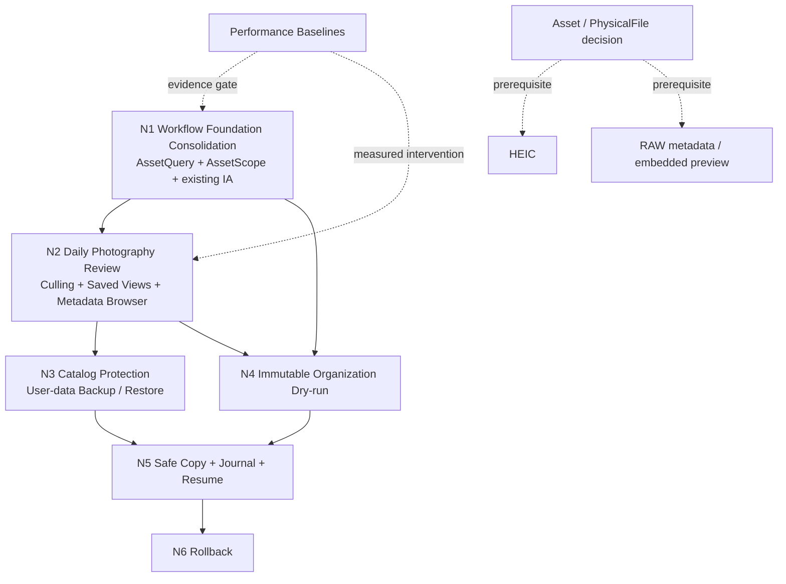

# Next-stage Product Strategy

- 状态：G_UI_REMEDIATION_REQUIRED — 查询契约保留，LAP-derived 工作台 IA 未通过，先执行 Plan 0021
- 日期：2026-08-10
- 依据：[Product Architecture Review](../product-architecture.md)
- 新综合基线：[Checkpoint G](../refactor/checkpoint-g-product-architecture-consolidation.md)

## 1. 目标

把 PhotoOrganizer 从“已有很多独立能力”收敛为一条稳定的摄影资产工作流：

```text
Existing Folders
  -> Fast Local Catalog
  -> Browse / Cull / Find / Compare
  -> Virtual Organization
  -> Inspectable Organization Plan
  -> Safe Organized Output
```

本计划首先处理产品架构和现有功能整合。它不授权实现 Smart Album、Culling、Backup、Organization 新能力、媒体扩展或 ANN。

## 2. 固定原则

1. Local-first、offline-capable；不引入账号、云同步或远程后端。
2. Folder-first；Physical Library 必须忠实于真实磁盘。
3. 正常浏览、分析和规划永远不修改 SourceRoot。
4. User-authored data 高于 derived intelligence；人工决定不被重分析覆盖。
5. Collection 是固定成员，Saved View 是动态 AssetQuery，Folder 是真实目录。
6. 操作范围必须通过 AssetScope 明确表达。
7. Organization 必须经历 Resolve Scope -> Snapshot -> Review -> Confirm。
8. Safe Copy 只能消费 confirmed immutable plan，不能执行时重算 query/rule/path。
9. 所有真实文件写操作最终只经过一个 FileOperationService 边界。
10. 性能优化必须由 benchmark 触发；不得因参考项目使用某方案就提前引入。

## 3. 当前架构债务排序

| 债务                                       | 用户影响 | 依赖影响                                | 处置                      |
| ------------------------------------------ | -------- | --------------------------------------- | ------------------------- |
| “智能工作台”割裂主浏览上下文               | 高       | 阻塞 Daily Workflow                     | G-UI 先修复               |
| Grid/Search/Collection/Review 多套查询结果 | 高       | 阻塞 Saved View、Metadata、Organization | 下一里程碑收敛            |
| 各操作自行解释 selection/current filter    | 高       | 阻塞可靠批处理和 snapshot               | 下一里程碑收敛            |
| Library/Folder/虚拟归属混用                | 高       | 阻塞媒体配对、Folder scope、backup 重连 | 先冻结语义，迁移延后      |
| Organization plan 不是完整执行快照         | 高       | 阻塞 Safe Copy                          | Phase 3 修复              |
| Edit copy/rollback 独立于统一文件操作边界  | 中高     | 增加安全维护成本                        | Safe Copy 设计时收编      |
| Saved View 只有 schema                     | 中       | 阻塞动态视图                            | Query 稳定后实现          |
| Thumbnail/vector 无规模数据                | 中高     | 可能错误选择依赖或算法                  | 下一里程碑先建 baseline   |
| User-authored catalog 无备份               | 高       | 数据可永久丢失                          | Phase 2，Safe Copy 前完成 |

## 4. 候选能力决策矩阵

级别说明：Value/Dependency/Risk/Cost 使用 Low/Medium/High；Dependency 高表示强依赖前置抽象，不表示优先级高。

| 候选能力                      | User Value                  | Workflow Dependency                    | Architecture Risk | Maintenance Cost | Evidence Required                                | 决策                            |
| ----------------------------- | --------------------------- | -------------------------------------- | ----------------- | ---------------- | ------------------------------------------------ | ------------------------------- |
| Existing workflow integration | High                        | Medium                                 | Medium            | Medium           | 两条端到端可用性脚本                             | 立即，唯一 Next Milestone       |
| AssetQuery V1                 | High                        | Low                                    | Medium            | Medium           | 当前查询路径审计已完成                           | 立即，与工作流整合为同一里程碑  |
| AssetScope V1                 | High                        | AssetQuery                             | Medium            | Low              | 当前批量入口审计已完成                           | 立即，与工作流整合为同一里程碑  |
| Thumbnail optimization        | High at scale               | Benchmark harness                      | Medium            | Medium           | 1k/10k/50k trace                                 | 按证据穿插                      |
| Vector optimization           | Medium/High                 | Benchmark harness                      | Medium            | Medium           | 1k/10k/50k/100k query trace                      | 按证据穿插                      |
| Culling state                 | High for photographers      | Unified Grid/Scope/keyboard review     | Low               | Low              | 用户脚本验证 Pick/Reject 与 Favorite/Rating 区分 | Phase 1                         |
| Saved Views                   | High                        | AssetQuery versioning                  | Medium            | Medium           | Query serialization/compatibility tests          | Phase 1                         |
| Metadata Browser              | High                        | AssetQuery predicates                  | Medium            | Medium           | 常用 EXIF completeness/query latency             | Phase 1                         |
| Catalog Backup/Restore        | High                        | User-data manifest + stable relinking  | High              | Medium           | restore/conflict/corruption tests                | Phase 2                         |
| Immutable Organization Plan   | Very High                   | AssetScope + versioned values          | High              | Medium           | stale/snapshot/path tests                        | Phase 3                         |
| Safe Copy                     | Very High                   | Confirmed plan + FileOperationService  | Very High         | High             | fault injection, no-overwrite, resume tests      | Phase 4                         |
| Rollback                      | High                        | Safe Copy journal/hash                 | Very High         | High             | modified-target and partial-job tests            | Phase 5                         |
| HNSW/ANN                      | Unknown until scale data    | Vector benchmark + index lifecycle ADR | Very High         | High             | 100k P95 after simple optimizations              | Not scheduled                   |
| HEIC                          | Medium                      | decoder/license/package ADR            | Medium            | Medium           | fixture and platform compatibility               | Core workflow stable 后单独评估 |
| RAW metadata/embedded preview | Medium/High niche           | Asset/PhysicalFile + codec ADR         | High              | High             | target camera fixture matrix                     | HEIC 后独立里程碑               |
| Video                         | Low for current positioning | New media pipeline                     | Very High         | Very High        | 独立产品需求                                     | 不在近期                        |
| Face identity / Map           | Low for differentiator      | model/privacy or GPS IA                | High              | High             | 明确用户需求                                     | 当前不做                        |

## 5. Milestone dependency map



## 6. N1 — Workflow Foundation Consolidation

当前先执行 G-UI 界面整合整改；N1 的 Query、Scope 和 benchmark 后置。原因是旧工作台的 IA 方向尚未通过，不能继续在错误的容器上扩展。

### 6.1 Why Now

- 当前每增加一个功能就会增加一个 query/result/selection 分支。
- `WorkflowWorkspace` 的八个 tab 已经让功能入口和用户意图错位。
- Saved View、Culling、Metadata 和 Organization 都依赖稳定 query/scope。
- 尚无证据支持 virtualization、batch thumbnail IPC、asset protocol、resident embedding cache 或 HNSW 中的任何一个方案。

### 6.2 Scope

1. Domain vocabulary
   - 固定 LibrarySource、FolderRef、Asset、legacy primary PhysicalFile、Collection、SavedView 的定义。
   - 明确 `asset_library_assignments` 是兼容债务，不再把它包装成 Folder-first 功能。
2. AssetQuery V1
   - 把当前 `libraryId + AssetFilter + sort + group + page` 收入版本化 envelope。
   - 为 Folder、metadata、user marks 和 search mode 保留可扩展位置，但不要求一次实现所有 predicate。
   - 保留现有 parameterized SQL builder，不引入 ORM/通用 rule engine。
3. AssetScope V1
   - 为 Query、Explicit IDs、Collection、Saved View、Similarity Cluster、Duplicate Group 定义 discriminated input。
   - 实现统一 resolver contract；Organization snapshot 语义只定义和测试，不开放 Safe Copy。
4. Existing IA integration（先由 Plan 0021 执行）
   - 删除产品层面的 generic “智能工作台”概念，而不是只改名。
   - Favorite/Collection 变为 browse source；Search 改变 current query；Similar/Duplicate 为 Review set；Compare/Batch Edit 为 selection action；Edit 为 asset action。
   - 隐藏 model-unavailable Faces 一级入口，隐私清理留在二级设置/状态。
   - 在现有 Grid/Preview surface 保持 active asset、selection、返回位置和 query 描述。
5. Performance baseline
   - Thumbnail：1k/10k/50k。
   - Vector：1k/10k/50k/100k。
   - 只记录数据和决策，不预设 batch/virtualization/ANN。
6. Documentation and tests
   - Contract serialization、query count/page consistency、scope resolution、state continuity、source integrity。
   - 修正文档中与实际实现冲突的运行说明。

### 6.3 Out of Scope

- 新增 Culling 列或 P/X 快捷键。
- 开放 Saved View CRUD/Smart Album。
- 新增 Metadata filter 字段全集。
- Backup/Restore。
- 修改 Organization rule 或执行 COPY。
- HNSW/ANN、HEIC、RAW、Video、GPS、Face model。
- 移动、删除、重命名、覆盖源文件。
- `Asset -> PhysicalFile[1..n]` migration。

### 6.4 Existing Components Reused

- Frontend：`App.tsx` current query/selection、Grid、Preview、Sidebar、DetailPanel、OrganizationWorkspace、WorkflowWorkspace 内的现有功能组件。
- API：现有 `fetchAssets`、Collection/Search/Similar/Duplicate IPC。
- Rust：`AssetFilter`、`asset_filter_sql`、recursive Library CTE、workflow candidate generators、Organization planner。
- Tests：visual fixture、App shell tests、repository query tests、source-integrity tests。

### 6.5 Schema Impact

预期为零。只新增 versioned DTO/contract。任何 migration 建议都必须单独停下评审。

兼容策略：

- `saved_views.query_json` 不写入未经版本化的临时 payload。
- 旧 `asset_library_assignments` 继续可读，不在 N1 删除或自动转换。
- Organization 0003 表保持只读 preview 兼容；不把它误称为 confirmed plan。

### 6.6 UX Impact

目标不是换皮，而是让用户始终知道：

- 当前正在浏览什么 source/query；
- 当前选中了什么 scope、是否跨页；
- Search/Similar/Duplicate/Collection 结果如何返回原上下文；
- Compare/Analyze/Organize 将作用于哪些图片；
- 当前只是 virtual operation、dry-run，还是未来真实 file operation。

### 6.7 Detailed work packages

#### N1.1 Contract inventory and naming freeze

- 输出所有现有 query/scope call site 清单。
- 定义 `AssetQueryV1`、`AssetScopeInputV1`、`ResolvedAssetScopeV1`。
- 为动态 search ranking 与 SQL filter 划定两阶段执行边界。
- 完成条件：类型可以表达现有行为，无 schema 或 UI 变更。

#### N1.2 Current query single source of truth

- 将 App 中 library/filter/sort/group/page/search-source 收敛为一个 reducer/store 边界。
- Grid count/page/result 使用同一 query；旧响应有 request generation guard。
- 不在此阶段实现全部未来 filter。
- 完成条件：当前功能没有各自复制 query state。

#### N1.3 Scope resolver

- 统一 selection、current query、collection 和 review candidate 的解析入口。
- 明确跨页 selection 与 fingerprint snapshot。
- Analyze/Compare/Add to Collection/Organization 改为适配 scope contract。
- 完成条件：每个批量动作在日志/API/test 中能说明精确作用范围。

#### N1.4 Existing IA recomposition

- 把 `WorkflowWorkspace` 拆成可复用 source/action/review components。
- 移除 generic workbench 路由；保留既有业务能力。
- 为两个用户脚本做桌面人工验证。
- 完成条件：没有必须先进入八标签容器才能找到的已有功能。

#### N1.5 Performance harness and baseline

- 建立确定性 catalog/thumbnail/embedding fixtures。
- 输出 JSON，包含硬件、build profile、cache state、规模和分段指标。
- 不因 baseline 结果直接引入生产依赖；若命中红线，先提交单独优化方案。
- 完成条件：同一机器重复结果差异可解释，1k–100k 数据齐全或明确记录当前 hard cap。

#### N1.6 Verification and documentation

- 自动化：serialization、migration compatibility、query consistency、scope resolution、UI state continuity、source hash。
- 手工：Browse -> Similar -> Compare -> mark -> back；Collection/Query -> Organization scope preview。
- 更新 architecture/current functionality/testing。
- 完成条件：全部 gate 通过后创建独立 implementation checkpoint，停止等待审核。

### 6.8 Acceptance Criteria

- `AssetQueryV1` 是 current Grid 的唯一查询契约，并有 schema/version tests。
- `AssetScopeInputV1` 覆盖现有所有批量入口；“当前页面”不再作为隐式范围。
- count、page、result 和 Organization filtered scope 对同一 query 一致。
- Search/Collection/Review result 能留在统一浏览 surface，并保持 selection/active/back context。
- Compare、Similar、Duplicate、Edit 的入口符合 selection/asset/review 语义。
- generic “智能工作台”和 unavailable Faces 不再占据一级 IA。
- 生成 thumbnail/vector baseline 报告；优化建议逐项关联证据。
- 无新 migration、生产依赖或文件写入能力。
- 原图 fixture hash/mtime/目录项不变。
- format、lint、typecheck、frontend tests、Rust tests、clippy、build 全部通过。

### 6.9 Risks

- `App.tsx`、`WorkflowWorkspace.tsx` 和 `styles.css` 已高度集中，拆分可能造成视觉/快捷键回归。
- 语义 search 的 similarity sort 与 SQL filter/page 组合需要明确 top-k/overfetch 策略。
- 旧手工 Library 层级和 asset assignment 仍会在兼容期制造认知歧义。
- 当前 `previewAssetId` 与 `activeAssetId` 双状态会影响 state consolidation。
- 大规模 benchmark 若生成不真实的数据分布，可能低估 SQLite/BLOB/disk 行为。

## 7. Later milestones

### N2 — Daily Photography Review

Dependencies：N1。内容候选：Culling、Saved Views、Metadata Browser，以及把现有 Compare/Similar/Collection 完成产品化。Culling 必须与 Favorite/Rating 独立：

```text
Unflagged -> P/X first pass -> rate Picks -> search/compare -> organize
```

只有当此流程的键盘操作、Grid/Preview 同步和 query persistence 验收后，才实现 `culling_state`。

### N3 — Catalog Protection

Dependencies：AssetQuery/Saved View format、stable relinking manifest。备份 user-authored data 和必要 operational records；derived caches 默认排除。Restore 必须先 preview 冲突并保护当前 DB。

### N4 — Immutable Organization Dry-run

Dependencies：AssetScope、user metadata、metadata query。Plan 冻结：resolved scope、source path/fingerprint、规则版本、Effective values/revisions、target path、issues 和生成时间。Plan 确认后不随 Rating/AI/filter 改变；变化只使其 stale 或要求重新生成。

### N5 — Safe Copy

Dependencies：confirmed plan、backup、统一 FileOperationService。只实现 copy/no-overwrite；按 plan item 执行，不重算。包含 journal、progress、cancel/resume、source verification、target verification。

### N6 — Rollback

Dependencies：Safe Copy audit。只移除应用生成、仍位于允许根且 hash 未变化的副本。Move/Delete 仍不在范围。

## 8. Performance evidence gates

### Thumbnail

- IPC fixed cost 主导：评估 batch。
- Base64/payload 主导：评估 local resource protocol。
- DOM/React 主导：评估 virtualization。
- decode/cache 主导：评估 cache dimensions/codec/prefetch。
- stale work 主导：评估 cancellation + viewport priority。

每个判断都必须附 profile trace 和 before/after，同一 fixture、同一 Release binary。

### Vector

先按顺序评估：

1. 避免重复读取和反序列化；
2. resident cache 生命周期；
3. contiguous normalized matrix；
4. optimized/SIMD dot product；
5. mmap（仅在确有 memory/startup 收益时）；
6. ANN ADR。

在 100k benchmark 之前不得把 HNSW 加入业务 roadmap。

## 9. Media expansion gates

- HEIC：独立消费者格式里程碑；需要 decoder/license/package/Windows fixture 证据。
- RAW：先完成 Asset/PhysicalFile 设计；第一阶段只 metadata、embedded thumbnail/preview、viewer、RAW+JPEG pairing，不做显影。
- Video：独立 pipeline 和产品需求，不与“更多格式”合并。

## 10. Stop condition

本次 review 已形成 G-UI 整改计划。当前只允许修复 LAP-derived 功能的主界面集成；N1 benchmark、Culling、Saved View、Backup 和 Safe Copy 必须等待 G-UI 验收。
