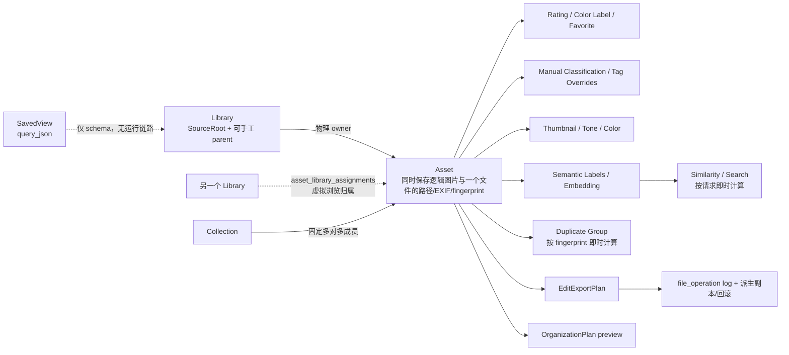
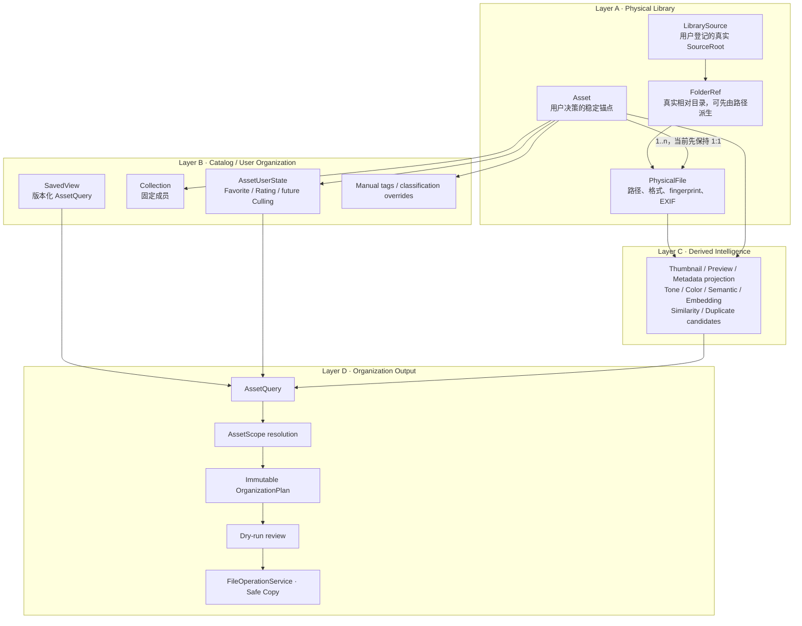
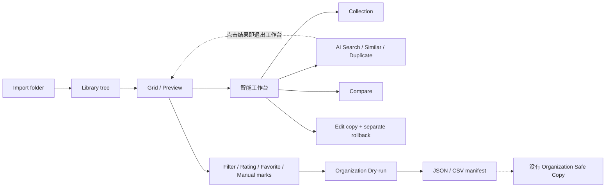

# PhotoOrganizer Product Architecture Review

> 状态：Review complete；不代表后续功能已获准实现。<br>评审日期：2026-08-10<br>代码基线：`main` / `3fb17ed`，并包含工作区中尚未提交的导入与语义吞吐修正。<br>LAP 对照基线：`julyx10/lap` / `4d0960f`。仅研究产品概念、工作流和性能策略；LAP 为 GPL-3.0-or-later，禁止复制其源码、schema、样式、测试、图标和文案。

## 结论

PhotoOrganizer 已有可靠的本地索引、只读扫描、图像分析和安全规划基础，但目前还不是一条连贯的摄影工作流。主要问题不是缺功能，而是四个基础概念没有收敛：

1. `Library`、真实 `Folder` 和虚拟归属发生混用。`asset_library_assignments` 可以把图片“拖到另一个 Library”但不改变物理路径，手工 `parentLibraryId` 也可以脱离真实目录关系；这使物理层不再完全忠实于磁盘。
2. Grid、收藏、集合、语义搜索、相似图、重复组和整理预览分别维护查询或成员逻辑，没有统一 `AssetQuery`。
3. 批量分析、比较、集合、编辑和整理使用不同方式解释“当前图片”，没有统一 `AssetScope`。
4. “智能工作台”把八种不同意图塞进一个替换主界面的工具箱。搜索结果、相似结果或重复结果点击后会直接退出工作台，选择和上下文难以连续流动。

因此应暂停继续扩展 LAP 功能列表。下一里程碑应是“现有工作流与 Query/Scope 收敛”，不新增业务能力、不做 schema 大迁移。Organization Dry-run 仍是产品差异化主线，但必须在统一范围模型之后升级为真正可执行的不可变快照。

## A. Capability Inventory

状态含义：

- `Production-ready`：在当前 MVP 边界内有稳定实现和自动化保护。
- `Functional but UX incomplete`：代码可运行，但入口、上下文、状态连续性或人工验收不足。
- `Backend only` / `UI only`：仅一侧存在，不能形成完整用户能力。
- `Experimental`：有实现，但规模、质量、安全边界或产品语义尚未完成验证。
- `Duplicate`：与另一概念重复表达同一意图。
- `Dead / unused`：当前产品路径没有消费。

| 能力                                             | 状态                                                 | 真实情况与主要缺口                                                                                                                                                                    |
| ------------------------------------------------ | ---------------------------------------------------- | ------------------------------------------------------------------------------------------------------------------------------------------------------------------------------------- |
| JPEG/PNG/WebP 递归扫描、增量索引、取消和缺失检测 | Production-ready                                     | 有 repository/scanner 集成测试和源文件完整性约束；格式范围仍是 MVP 范围。                                                                                                             |
| 应用私有缩略图生成与缓存失效                     | Production-ready                                     | 导入和分析已共享 `grid-640-v1` 缩略图；有效缓存可直接用于基础特征重算，JPEG 优先使用 EXIF 内嵌预览。                                                                                  |
| 图库树和递归 Library scope                       | Functional but UX incomplete                         | 递归计数/查询存在，但手工层级可脱离物理目录；未完成旧 Checkpoint A 的桌面人工验收。                                                                                                   |
| 真实 Folder 浏览                                 | Backend only / Dead                                  | `list_library_folders` 和 `FolderSummary` 存在，但主查询没有 folder 条件，Sidebar 没有真实目录浏览入口。                                                                              |
| 图片拖到 Library 的虚拟归属                      | Duplicate / product conflict                         | `asset_library_assignments` 不移动源文件，却改变浏览归属；它重复了 Collection 的虚拟组织职责，并污染 Physical Library 语义。                                                          |
| SQLite 分页 Grid、稳定排序、基础组合筛选         | Production-ready                                     | `list_assets` 的 count/page 共用 SQL 条件；当前 `AssetFilter` 仍缺文件类型、相机、镜头、分辨率、收藏、Collection 和 Folder。                                                          |
| 单图预览、胶片栏、缩放和 Navigator               | Functional but UX incomplete                         | 可用，但 `activeAssetId` 与 `previewAssetId` 两套当前图片状态仍并存，Checkpoint C 的单一状态目标未实现。                                                                              |
| EXIF/Metadata Inspector                          | Production-ready for display                         | 相机、镜头、ISO、光圈、快门、焦距可展示；绝大多数字段尚不可查询。                                                                                                                     |
| Tone/Color 分析和筛选                            | Production-ready within current algorithm            | 可查询并支持人工 override；Checkpoint D 要求的完整评测和版本语义仍未全部验收。                                                                                                        |
| TinyCLIP 分类与任务恢复                          | Functional but UX incomplete                         | 本地运行、版本/fingerprint 约束、批处理和缩略图输入已实现；摄影评测集和逐类质量门槛仍不充分。                                                                                         |
| Favorite、Rating、Color Label                    | Production-ready                                     | 数据持久化、卡片/详情操作和筛选存在；Favorite 还通过工作台复制出第二个浏览入口。                                                                                                      |
| Manual classification/tag overrides              | Functional but UX incomplete                         | Auto/Manual/Effective 边界已实现；Checkpoint B 仍等待桌面人工验收。                                                                                                                   |
| Collection                                       | Functional but UX incomplete                         | 固定多对多成员关系正确且不改原图；只能在智能工作台中管理，不能作为主 Grid source 或 Organization scope。                                                                              |
| Saved View                                       | Backend only                                         | 只有 `saved_views` 表和迁移合并测试；没有 domain API、IPC、UI、query 版本校验或运行时解析。                                                                                           |
| 文件名/路径搜索                                  | Production-ready                                     | 是 `AssetFilter.search` 的 SQL 条件，但与 AI 搜索是两个不相干入口。                                                                                                                   |
| AI 文本搜索                                      | Functional but UX incomplete / Experimental at scale | 能生成文本 embedding 并精确余弦排序；独立结果视图会打断主浏览，硬上限 10,001，暂无规模 benchmark。                                                                                    |
| 以图搜图                                         | Functional but UX incomplete / Experimental at scale | 基于当前 embedding 精确搜索；入口藏在工作台，点击结果后退出工作台；同样受 10,001 上限影响。                                                                                           |
| 相似聚类                                         | Experimental                                         | 5,000 embedding 上限和自定义候选窗口可避免无界计算，但没有召回率或大规模延迟证据。                                                                                                    |
| 精确重复分组                                     | Functional but UX incomplete                         | 复用完整 BLAKE3，不重读源文件；“生成待处理 Collection”是临时衔接，不是完整 Review 流程。                                                                                              |
| 双图/四图比较                                    | Functional but UX incomplete                         | 复用当前选中 ID，最多四张；选择通常来自当前 120 张页面，缺少从 Search/Review set 连续进出和标记决策。                                                                                 |
| 编辑预览、派生副本和回滚                         | Experimental / architecture conflict                 | 有安全校验、日志和 hash 保护，但它在 Organization 之前单独建立了真实文件写入/删除边界，与未来统一 `FileOperationService` 重复。                                                       |
| Organization Dry-run                             | Functional but UX incomplete                         | 能从 All/Filtered/Selected 生成完整前端映射和冲突诊断；尚不能消费 Collection/Saved View 等 scope。                                                                                    |
| Organization immutable snapshot                  | Backend only / incomplete                            | DB 保存 asset id、fingerprint、目标相对路径等，但不保存完整 source path/context；`get_organization_plan` 不返回 items，manifest 接收前端传回的 plan。不能作为未来 COPY 的唯一事实源。 |
| Organization Safe Copy                           | Backend only placeholder                             | 通用操作表存在，但没有消费 confirmed OrganizationPlan 的执行器、进度和恢复。                                                                                                          |
| Face workspace                                   | UI only / Dead                                       | UI 只显示 `model_unavailable` 和清理按钮；当前没有已许可模型或有效检测能力，不应占据一级工作流入口。                                                                                  |
| `get/list/discard organization plan` 前端 API    | Dead / unused                                        | 后端和 API 有部分入口，但当前 Organization UI 不恢复计划、不列出历史、不消费这些 API。                                                                                                |

### 能力审计结论

核心索引和分析能力可以继续复用。当前最需要停止的是“再建一个独立页面/SQL 路径”的扩张方式。尤其应停止把 Folder、Favorite、Collection、Search、Review 和 Edit 都当成平级工作台标签。

## B. Core Domain Model

### 当前真实模型



当前没有独立 Folder 实体；相对路径既承担物理目录信息，又没有进入主查询。`Asset` 则把用户长期标记的逻辑对象与一条物理文件记录绑定在同一行。

### 建议模型



### 演进原则

1. 现在不做 `Asset`/`PhysicalFile` schema 迁移。先冻结术语：现有 `assets` 行视为“Asset + primary physical file 的 legacy projection”。
2. 新的用户自产数据必须以逻辑 `asset_id` 为锚点，不能直接以绝对路径为身份。
3. 在 HEIC sidecar、Live Photo 或 RAW+JPEG 进入获批里程碑前，再增加 `physical_files(asset_id, role, path, fingerprint, ...)`。Rating、Favorite、Culling、Collection 继续挂在 Asset，而不是每个 companion file。
4. `AssetGroup` 不应现在成为持久化核心。未来若需要跨 Asset 的 burst/duplicate/capture grouping，可作为独立、可重算或用户确认的分组；同一张照片的 RAW+JPEG 更适合 `Asset -> PhysicalFile[1..n]`。
5. `LibrarySource` 只表示真实导入根。真实目录层次来自 Folder；人为分组应使用未来的 `LibraryGroup` 或 Collection，不能继续改变物理 Library 语义。
6. `asset_library_assignments` 应停止扩展。下一里程碑只需标记为待迁移兼容层，不立即删除数据。

## C. Query Architecture

### 当前查询路径

| 消费者          | 当前实现                                                                             | 问题                                                                      |
| --------------- | ------------------------------------------------------------------------------------ | ------------------------------------------------------------------------- |
| Grid            | `Repository::list_assets(library_id, sort, direction, page, page_size, AssetFilter)` | 最接近可扩展核心，但 query envelope 被拆成多个参数。                      |
| Sidebar filters | 修改 React `AssetFilter`，进入同一 SQL builder                                       | 可复用；没有 Folder、EXIF 高级字段、Favorite、Collection。                |
| Folder          | `list_library_folders` 单独统计                                                      | 不参与 Grid query，UI 未消费。                                            |
| Favorite        | `workflow.rs` 独立 SQL                                                               | 与 Grid filter 重复，返回不同 DTO。                                       |
| Collection      | `collection_assets` 独立 join                                                        | 不能叠加现有筛选、排序、分组、分页。                                      |
| AI Search       | 一次加载最多 10,001 个 embedding，内存余弦和排序                                     | 不复用 Grid predicate/pagination，结果是另一个列表。                      |
| Similar         | 同上，以某个 asset embedding 为 query                                                | 不复用 Grid query。                                                       |
| Duplicate       | fingerprint 聚合和独立 DTO                                                           | 合理的候选生成器，但结果无法进入统一浏览/筛选。                           |
| Saved View      | 无运行实现                                                                           | `query_json` 没有版本契约。                                               |
| Organization    | 把 All/Filtered/Selected 再翻译为 `AssetFilter + IDs`，分页加载全部结果              | 复用了 SQL filter 是优点，但 scope 语义局限且没有统一 snapshot resolver。 |

### 是否需要 AssetQuery

需要，但应从现有 `AssetFilter` 和 SQL builder 演进，不新建通用 ORM 或规则引擎。建议第一版只建立一个版本化 envelope：

```text
AssetQueryV1
  version
  source
    libraryId
    includeDescendantLibraries
    optional folder { relativePath, recursive }
    optional collectionId
  filter
    existing AssetFilter fields
    fileType / dimensions / camera / lens / exposure ranges
    favorite / rating / colorLabel / future culling
  search
    none | filename/path | semanticText | similarToAsset
  sort { field, direction }
  group { field } | none
  page { cursor-or-number, size }
```

实施约束：

- `AssetFilter` 保留为 predicate 子结构，现有 `asset_filter_sql` 继续是 SQL 过滤核心。
- 语义文本和相似图允许使用专门的 candidate/ranking stage，但输出必须再进入同一 query result contract，而不是生成另一个孤立工作台列表。
- Duplicate Group 和 Similarity Cluster 是“候选集合/Review set”，不必硬塞进 SQL predicate；它们可以解析为临时 scope，再以统一 Grid 呈现。
- Saved View 保存的是版本化 `AssetQuery` 加 `sort/group/viewMode`，不保存瞬时页码、当前选中项或已解析 asset id。
- Collection 仍是固定成员；Saved View 仍是动态查询；Folder 仍是真实物理路径。三者不得互换命名。
- 未知 query 版本必须拒绝或迁移，不能静默当作空筛选。

## D. Scope Architecture

### 当前范围解释

| 操作                         | 当前范围来源                                 |
| ---------------------------- | -------------------------------------------- |
| Batch classification / marks | `selectedAssetIds`                           |
| Analyze selected             | `libraryId + selectedAssetIds`               |
| Compare                      | 当前 selection 加 active asset，截断为 4     |
| Add to Collection            | `selectedAssetIds`                           |
| Edit                         | 单个 `activeAsset`                           |
| Duplicate review             | 独立 duplicate result；可转换为新 Collection |
| Similar/Search               | 独立结果数组                                 |
| Organization                 | enum `all/filtered/selected` + filter + IDs  |

这些接口无法稳定回答“Current Query 是否包含未加载页”“Collection 后来变化是否影响已确认计划”“当前 Selection 是否来自 Search 结果”等问题。

### 建议 AssetScope

```text
AssetScopeInputV1 =
  Query(AssetQueryV1)
  ExplicitAssets(assetIds)
  Collection(collectionId)
  SavedView(savedViewId)
  SimilarityCluster(clusterHandle)
  DuplicateGroup(groupHandle)

ResolvedAssetScopeV1
  description
  resolvedAt
  sourceRevision
  items[] { assetId, sourceFingerprint }
```

规则：

1. 批量操作必须显式接收 `AssetScopeInput`，UI 同时显示 scope 名称和预计数量。
2. 动态 query/collection/saved view 在开始操作时解析；普通分析可按解析结果排队，Organization 则把解析结果冻结进 plan。
3. “全部图片”只是一个明确的 Library query，不是每个模块自行解释的 magic enum。
4. Selection 是显式 ID 集；跨页选择不能依赖当前 React page array。
5. Similarity Cluster/Duplicate Group 若只在内存中存在，必须带模型/算法版本和创建时间；用于 Organization 前要解析成 fingerprint snapshot。
6. Scope resolver 是业务边界，不是前端把数组拼好后直接调用不同 IPC。

## E. User Data Classification

### 删除当前数据库后的后果

| 数据                                                 | 分类                               | 能否自动恢复 | 说明                                                                             |
| ---------------------------------------------------- | ---------------------------------- | ------------ | -------------------------------------------------------------------------------- |
| 原始图片与内嵌 EXIF                                  | 外部事实来源                       | 是           | 重新扫描可恢复，前提是文件仍在原处或可重新定位。                                 |
| Library roots、名称、顺序、手工层级                  | User-authored                      | 否           | 可从用户记忆重新添加，但原配置和手工关系会丢失。                                 |
| `asset_library_assignments`                          | User-authored（当前概念有问题）    | 否           | 删除 DB 后虚拟归属永久丢失。                                                     |
| Rating、Color Label、Favorite                        | User-authored / Irreplaceable      | 否           | 当前未写回原图或 sidecar。                                                       |
| Collections 与成员                                   | User-authored / Irreplaceable      | 否           | 不能从目录重建。                                                                 |
| Saved Views                                          | User-authored / Irreplaceable      | 否           | 当前尚未暴露，但一旦使用必须备份。                                               |
| Manual classification/tag overrides                  | User-authored / Irreplaceable      | 否           | AI 重跑不能恢复用户决定。                                                        |
| Edit recipe/plan、用户 preference                    | User-authored / Irreplaceable      | 否           | 当前 recipe 只在导出 plan 中持久化。                                             |
| 已确认 Organization Plan、文件操作日志               | Operational record / Irreplaceable | 否           | 未来 Safe Copy、恢复和审计依赖它们。未确认临时 preview 可重算。                  |
| Asset catalog 行与 EXIF projection                   | Derived，但包含重连锚点            | 大体可以     | 可重扫；恢复用户数据时需要稳定 locator/fingerprint 把备份重新关联到新 asset id。 |
| Thumbnail、Preview cache                             | Derived / Regenerable              | 是           | 可由 PhysicalFile 重建。                                                         |
| Tone、Color、AI labels、Embedding、Face derived data | Derived / Regenerable              | 是           | 模型/算法仍可用时可重算。                                                        |
| Similarity/duplicate candidates                      | Derived / Regenerable              | 是           | 当前大多按需计算。                                                               |
| Analysis jobs/progress                               | Ephemeral derived state            | 不必恢复     | 结果可重排队。                                                                   |

### Backup 结论

Catalog Backup/Restore 应排在 P1：不是当前下一里程碑，但必须在新增更多用户标记和开放 Organization Safe Copy 之前完成。备份不能只是整个 AppData ZIP；至少需要：

- schema/backup format version；
- Library 配置和用户偏好；
- Favorite/Rating/Color Label、Collection、Saved View、manual override、未来 Culling；
- 能把 user data 重新关联到文件的稳定 locator（source identity、relative path、fingerprint），而非假定旧 `asset_id` 永远有效；
- 已确认 plan 与文件操作审计（若存在）；
- 明确排除或可选择排除 thumbnails、previews、embeddings 等大体积可再生数据；
- restore preview、冲突报告、原 DB 备份和事务恢复。

## F. Workflow Map

### 当前实际可走路径



断点：

1. Import 后没有真实 Folder 导航；Library 节点还混入手工虚拟层级。
2. Search、Similar、Duplicate、Favorite 和 Collection 不是 Grid 的 query source，结果不能继续叠加筛选、比较和整理。
3. 工作台依赖从 Grid 带入的 selection，但打开后看不到原 Grid；点击结果又立即离开工作台。
4. Compare 只能消费已有 selection，不能稳定表达“比较当前重复组/相似组中的这四张”。
5. Culling 决策缺失；Favorite 和 Rating 被迫承担部分筛片语义。
6. Organization 只能 All/Filtered/Selected，不能直接消费 Collection、Saved View 或 Review set。
7. Dry-run 到 Safe Output 断开；编辑副本却绕开 Organization 提前建立了另一套写文件/回滚路径。

目标工作流应是：

```text
Import -> Browse -> Cull -> Find/Compare -> Virtual Organization
       -> Resolve AssetScope -> Immutable Dry-run Plan
       -> Safe Copy through one FileOperationService -> Verify -> Rollback
```

## G. Information Architecture

### 当前 IA

```text
Topbar
├─ Grid / Single Preview
├─ Filename Search / Filter / Sort
├─ Import / Analyze
├─ 智能工作台
│  ├─ Favorite
│  ├─ Collection
│  ├─ AI Search
│  ├─ Duplicate
│  ├─ Similar Cluster
│  ├─ Compare
│  ├─ Edit
│  └─ Faces (unavailable)
└─ Organization Preview

Library mode
├─ Left: Library tree + classification filters
├─ Center: Grid / Preview + mark filters
└─ Right: Inspector
```

“智能工作台”不是一个单一用户任务：Favorite/Collection 是导航 source，Search 是查找，Duplicate/Similar/Compare 是 Review，Edit 是单图动作，Faces 当前不可用。把它们放在同一 tab 容器只是代码上的打包，没有形成产品工作流。

### 建议 IA 原则

| 放置方式                | 能力                                                                             | 原因                                                                            |
| ----------------------- | -------------------------------------------------------------------------------- | ------------------------------------------------------------------------------- |
| 常驻导航                | Physical Libraries/Folders、All Photos、Favorites、Collections、未来 Saved Views | 它们决定当前浏览 source，应始终可见且可返回。                                   |
| 常驻查询栏              | 文件名/路径搜索、AI 文本搜索模式、Filter、Sort、Group                            | 都改变当前 Grid 的 `AssetQuery`。                                               |
| 右侧 Inspector          | EXIF、Tone/Color、Semantic、Rating/Favorite、manual override                     | 都描述或修改 active asset，不需要离开浏览。                                     |
| Selection 上下文操作栏  | Compare、Add to Collection、Analyze、批量 marks、Plan Organization               | 只有有明确 AssetScope 时才出现。                                                |
| Asset 上下文操作        | Find Similar、Edit、Locate in Folder                                             | 针对 active asset，而不是一级工作区。                                           |
| 独立 Review workspace   | Duplicate group、Similarity cluster、Compare                                     | 它们共享“候选集 -> 并排检查 -> 标记决定”的流程，应保持 query/selection 上下文。 |
| 独立 Organize workspace | Rule、immutable preview、issues、confirmed plan                                  | 这是跨多图的安全规划任务，值得独立空间。                                        |
| 二级状态/设置           | 模型准备、分析队列、性能/存储设置                                                | 不应长期占据主导航。                                                            |
| 暂时隐藏                | Faces                                                                            | 模型不可用时不应展示伪入口；保留隐私清理入口于设置即可。                        |

不应直接照搬某个固定导航树。实施前应先用现有功能完成两个可用性脚本：

1. 从 Folder/当前 Query 选图，Find Similar，挑 2–4 张 Compare，打标并回到原结果。
2. 从 Collection/当前 Query 进入 Organization，明确看到 scope 名称、数量和 snapshot 时间。

## H. LAP Comparison

| 分类           | LAP 概念                                                                                                       | PhotoOrganizer 判断                                                                                                                |
| -------------- | -------------------------------------------------------------------------------------------------------------- | ---------------------------------------------------------------------------------------------------------------------------------- |
| 已经拥有       | Folder-first 本地库、Favorite/Rating、Collection、本地 AI 搜索、相似/重复、四图比较、基础编辑、缩略图缓存      | 不应重复造功能；应收敛现有入口和状态。                                                                                             |
| 真正值得借鉴   | Culling 的独立语义、Smart Album 作为保存规则、Metadata 浏览维度、数据库备份意识、viewport-first thumbnail 调度 | 借鉴产品责任和验证方法，独立设计实现。                                                                                             |
| 需要改造后借鉴 | Smart Album、drag/drop、Duplicate/Similarity Review、RAW+JPEG/Live Photo 分组                                  | Smart Album 必须成为 Saved AssetQuery；Drop 要保持 Folder-first；分组要进入 Review/AssetScope；媒体配对先解决 Asset/PhysicalFile。 |
| 没有必要       | 把完整文件管理器、地图、人物身份和大量媒体能力作为当前主线                                                     | 它们不强化 PhotoOrganizer 的“可检查整理计划”差异化。                                                                               |
| 当前不应该做   | HNSW、RAW、HEIC、Video、GPS/Map、Face identity、Trash、Move/Delete、Managed Import                             | Query/Scope、IA、backup 语义和 immutable plan 尚未稳定；缺 benchmark 或前置模型。                                                  |

LAP 的 100k+ 宣称和具体优化只能作为待验证假设，不能作为 PhotoOrganizer 的性能证据。

## I. Performance Review

### 已有证据与未知项

| 领域           | 已有证据                                                                                                                                                | 仍是猜测                                             |
| -------------- | ------------------------------------------------------------------------------------------------------------------------------------------------------- | ---------------------------------------------------- |
| 冷导入         | 隔离 release 基准（2 张 4000×3000 JPEG）约 360 ms；源 decode 223 ms、resize 117 ms。缓存复用约 204 ms 且源 decode 为 0；暖扫描约 141 ms 且无图像处理。  | 1k/10k/50k 导入吞吐、内存和跨格式表现。              |
| 语义推理       | 48 个图标的 TinyCLIP CPU microbenchmark；release 批次 8 约 76.8 张/秒、批次 32 约 87.7 张/秒；应用输入严格为 thumbnail-only。                           | 大库任务调度、真实摄影图质量、长期内存。             |
| Thumbnail 展示 | 已知链路是每个组件一次 IPC -> Rust 读 cache -> Base64 -> data URL -> Browser decode；页面 120 项，无 virtualization、batch、priority queue 或主动取消。 | 首屏、滚动帧、IPC/Base64/DOM/解码各自占比。          |
| 文本/相似搜索  | 已知每次查询从 SQLite 读取 BLOB，逐个分配 `Vec<f32>`，重复计算 norm/点积并排序；硬上限 10,001。                                                         | 1k–100k 的 load/deserialization/scoring 分解和 P95。 |
| 相似聚类       | 5,000 上限，top-dimension candidate window + exact check。                                                                                              | 候选召回率、质量、延迟和内存。                       |

### Thumbnail benchmark plan

只使用 `test-data/` 生成的合成图片及隔离 AppData/benchmark output，不读取个人图库。

规模：1k、10k、50k catalog；冷 cache 与暖 cache；普通进入、连续翻页、快速滚动/切换 query 三类场景。

记录：

- app shell 到首个 thumbnail、首屏 90%/100% thumbnail 的时间；
- P50/P95 frame time 和 long task；
- React commit、可见 DOM 数、卸载后请求数；
- IPC call count、每调用/总 payload、Base64 膨胀字节；
- SQLite query count/time；
- cache hit/miss、disk read、browser decode count/time；
- peak working set 和 JS heap；
- stale response、取消后仍处理请求和翻页后无效后台工作。

诊断顺序：

1. DOM/React 明显主导才评估 virtualization。
2. IPC 调用固定成本主导才评估 batch IPC。
3. Base64/payload 主导才评估受控 asset protocol/local URL。
4. cache miss/decode 主导才调整 cache spec、预取或解码策略。
5. 只有 viewport trace 证明顺序问题，才增加 priority/preload scheduler。

初始红线用于触发调查，不是跨机器发布承诺：暖 cache 首屏 90% 超过 1 秒、快速滚动 P95 frame 超过 33 ms、stale 请求超过总请求 10%、一次稳定首屏超过 120 个 thumbnail IPC，或 50k catalog 浏览导致工作集额外增长超过 500 MiB。

### Vector benchmark plan

规模：1k、10k、50k、100k 个与当前模型维度一致的、已归一化合成 embedding；另用小型摄影夹具验证结果正确性。每种规模执行 cold/warm text query、similar-to-asset 和重复 query 至少 30 次。

分段记录：

- text embedding 时间；
- SQLite statement 与 BLOB read；
- BLOB -> float 反序列化和 allocation；
- normalization；
- dot product/scoring；
- top-k/sort；
- 总 P50/P95、peak memory、warm reuse 命中。

先比较当前实现、resident cache、连续矩阵、预归一化和优化 dot product。只有在简单方案后，目标规模仍无法达到约 250 ms 的交互式 P95，且 memory/rebuild 数据可接受，才允许提出 ANN ADR。ANN ADR 还必须覆盖 persistence、模型版本、增量 insert/delete、重建、损坏恢复和精确回退。

## J. Revised Roadmap

路线图不再以功能数量排序。详细依赖和证据门见 [roadmap.md](roadmap.md) 与 [next-stage-product-strategy.md](plans/next-stage-product-strategy.md)。顺序为：

1. Workflow Foundation Consolidation：统一术语、AssetQuery/AssetScope 契约，重组现有入口，建立性能基线。
2. Daily Photography Review：在统一 Grid/Review 上评估并实现 Culling、Saved Views 和 Metadata Browser。
3. Catalog Protection：按 user-authored 数据语义实现 Backup/Restore。
4. Immutable Organization Dry-run：把 scope、规则、user/derived values、source path/fingerprint 和 target path 冻结为可确认 snapshot。
5. Safe Copy：唯一 FileOperationService 消费 confirmed plan；journal、verify、progress、resume。
6. Rollback：只处理应用生成且 hash 未变化的副本。

Thumbnail/Vector 是 evidence-gated 横向工作，不作为固定“功能阶段”。HEIC、RAW、Video 是独立媒体轨道，核心工作流稳定后再按前置依赖启动。

### 已发现的文档/代码不一致

| 位置                                            | 不一致                                                                                                                            |
| ----------------------------------------------- | --------------------------------------------------------------------------------------------------------------------------------- |
| `docs/roadmap.md`（旧版）                       | 把已存在的连续特征、筛选、TinyCLIP 和 Dry-run 仍列为未来 M1/M2。                                                                  |
| `docs/requirements.md`                          | 声称文件整理执行未开放且 rollback 排除；Organization 的确未开放，但 Edit 已可写派生副本并执行 rollback。                          |
| `docs/architecture.md`                          | 声称查询边界包含“原始目录”，实际 `AssetFilter` 和 `asset_filter_sql` 没有 folder predicate。                                      |
| `docs/current-functionality.md`                 | 声称支持原始目录前缀筛选，当前 Sidebar/Grid 没有该能力；同时把手工 Library/asset assignment 描述成 Folder-first，实际是虚拟归属。 |
| `docs/data-model.md` / migration 0003           | 明确说 plan mapping 可重算且不作执行队列；这与未来 confirmed snapshot 必须是 COPY 唯一输入的目标冲突。                            |
| `docs/plans/0018-*`                             | 状态写为 MVP implemented，但 Saved View、虚拟化和完整工作流整合并未实现。                                                         |
| Checkpoint A 文件 vs `IMPLEMENTATION_STATUS.md` | A 文件头仍是 `NOT_STARTED`，状态表却是 `BLOCKED_FOR_REVIEW`。                                                                     |
| Checkpoint C/D/E/F                              | 仍写 `NOT_STARTED`，但相关预览、语义/色彩、Dry-run 和独立 Edit copy 已部分存在；它们又没有达到各自 Exit Criteria。                |
| `docs/refactor/README.md`                       | 开头称 B–F 尚未开始，与 B 和后续能力的真实实现不符。                                                                              |

这些文档不应通过简单标记“完成”来修饰；新的综合 Checkpoint 会把“已有代码”和“已通过里程碑验收”分开记录。

## K. Next Milestone

### 当前选择：G-UI LAP-derived UI Integration Remediation

这是一个界面架构纠偏里程碑。当前先修复从 LAP 引入后被错误打包成独立工作台的功能，不继续在错误容器上叠加 Query、benchmark 或新功能。用户选择或查询出一组图片后，必须能在 Browse、Find、Review、Compare、Collection 和 Organization 之间连续流动且含义不变。

#### Why Now

- 继续增加 Saved View、Culling 或 Metadata filter 会复制现有查询分叉。
- 继续扩张“智能工作台”会让更多能力脱离主 Grid；必须先完成 G-UI。
- Organization 不能在范围语义不稳定时升级为 confirmed snapshot。
- 缩略图和向量性能当前没有足以选择实现方案的证据。

#### Scope

- 保留 `AssetQueryV1` 和 `AssetScopeInputV1` 技术契约，但不继续扩展旧工作台。
- 用现有功能重组 IA：取消泛化“智能工作台”产品概念，把 Search、Favorite/Collection、Similar、Duplicate、Compare、Edit 放回各自上下文。
- 让主 Grid/Preview 成为统一结果 surface，右侧/底部承载上下文动作。
- 增加 source、review、selection 和返回上下文的 state continuity 测试。
- G-UI 通过后，再建立 thumbnail/vector benchmark baseline。

#### Out of Scope

Smart Albums/Saved View UI、Pick/Reject、Backup、HNSW、HEIC、RAW、Video、GPS、Face、Organization 新规则、Safe Copy、Move/Delete、schema 大迁移。

#### Existing Components Reused

`AssetFilter`、`asset_filter_sql`、recursive Library scope、Grid/Preview、selection、Collection/Similar/Duplicate backend、Organization request、现有 visual fixture 和 Rust repository tests。

#### Schema Impact

预期无 migration。`saved_views.query_json` 只确定未来版本 envelope，不在本里程碑开放 CRUD。`asset_library_assignments` 保持兼容读取，但停止作为新 IA 的目标概念。

#### UX Impact

主界面从“图库 + 一个八标签工具箱”变为“当前 query 的 Grid/Review + 上下文动作”。用户在 Search/Similar/Duplicate/Collection 结果中应保持 selection、active asset、返回位置和 scope 描述。

#### Acceptance Criteria

- 只有一个可序列化、版本化的 current `AssetQuery` 状态；Grid count/page/result 共用它。
- 所有批量入口明确显示并传递 `AssetScope`，不再使用含糊的“当前页面”。
- Search/Collection/Review 结果可由统一结果 surface 展示并叠加允许的筛选/排序。
- Compare、Add to Collection、Analyze 和 Organization 都从明确 scope 启动。
- generic “智能工作台”及不可用 Faces 一级入口退出主 IA；现有能力没有被删除。
- thumbnail/vector benchmark 输出机器信息、规模、冷暖状态和分段指标。
- 不新增生产依赖或 migration；不执行新的文件写操作。
- frontend/Rust tests、lint、format、typecheck、build 和 source-integrity tests 通过。

#### Risks

- 当前 `App.tsx` 状态集中且 `WorkflowWorkspace.tsx` 体积大，重组时容易发生状态回归。
- 语义排序和 SQL 分页的组合需要明确两阶段执行，不能假装所有 query 都是一条 SQL。
- 旧 `asset_library_assignments` 的兼容展示可能继续让用户误解物理位置。
- benchmark fixture 若不控制 cache、图片尺寸和硬件信息，结果不可比较。
- 在没有可用性脚本前只改导航名称，无法真正修复工作流。
